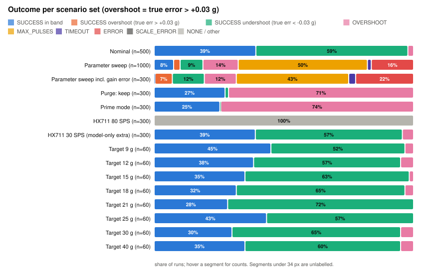
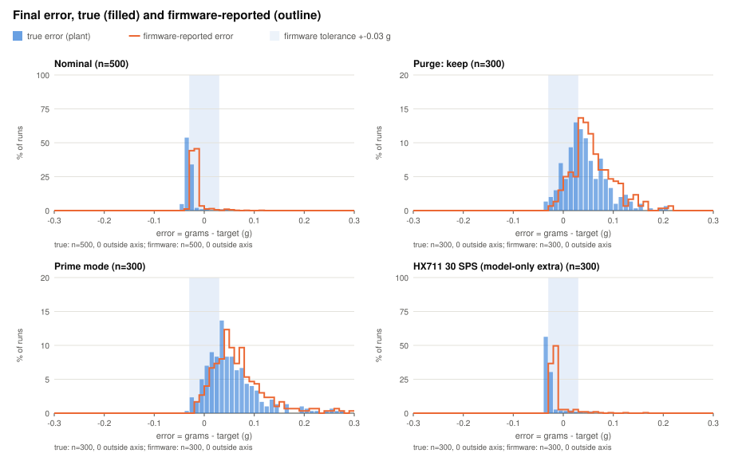
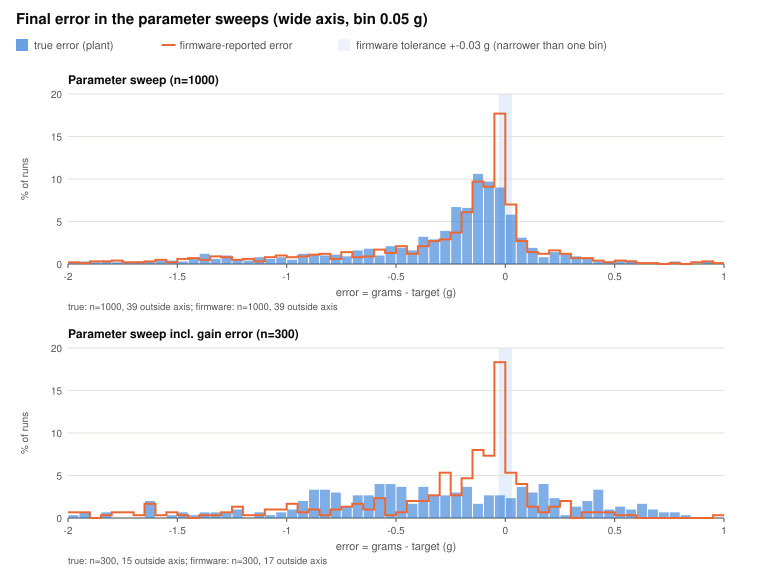
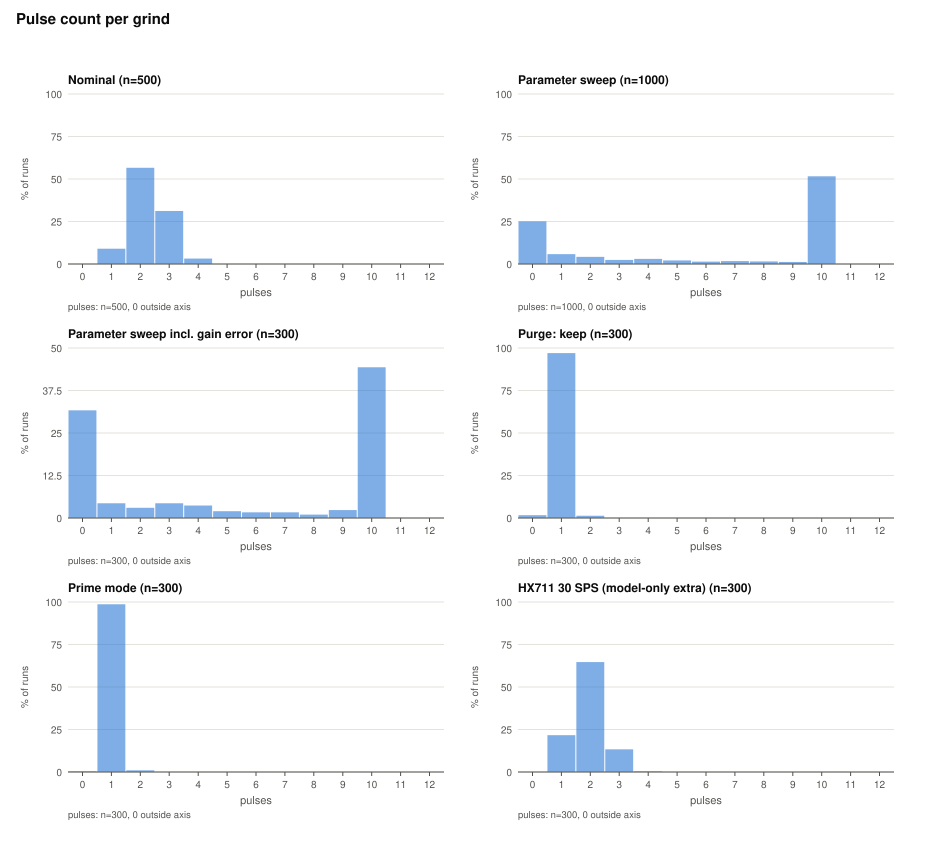
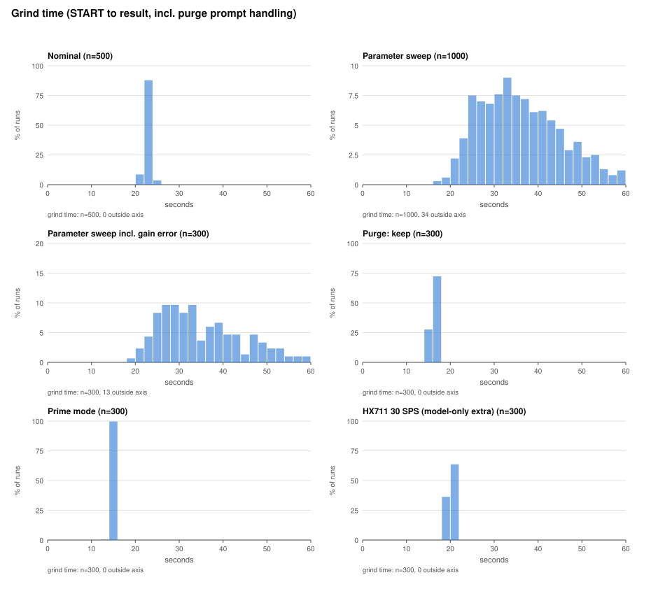
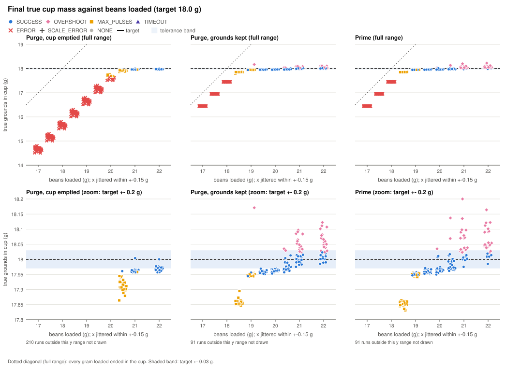
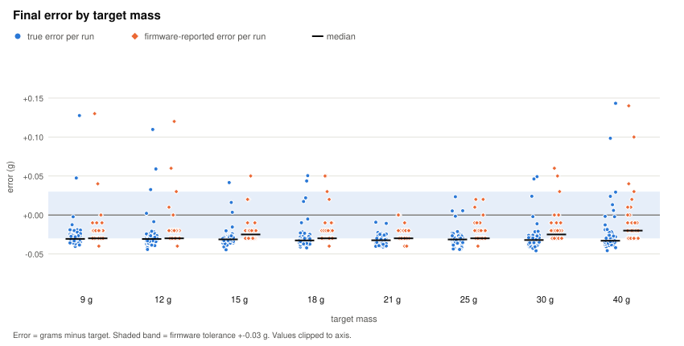
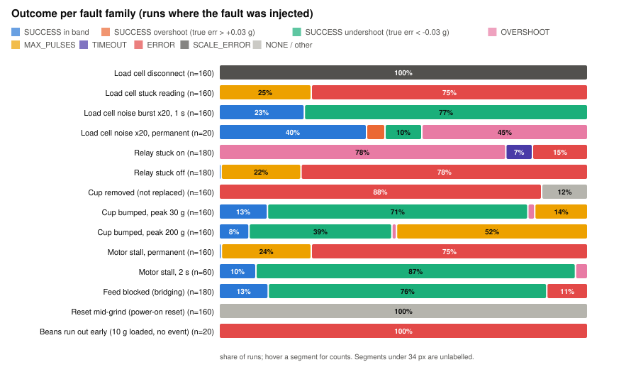

# Monte Carlo report: grind controller in the digital twin

Generated by `sim/mc/run_mc.py`; `grindsim` binary sha256 prefix `0bdb4e370a01`. The report contains no timestamps or wall times, so the same binary and seeds reproduce it exactly.

Everything below is **model output**. The plant (grinder, grounds path, load cell, HX711) is a model in which 32 of its 38 parameters are placeholders (`source` = `placeholder` in `sim/plant/params_default.json`); none has been measured on real hardware. Nothing here is a statement about a real grinder.

## 1. Summary of runs

| Set | Seeds (first..last) | Scenario files | Runs | Failing runs | Failing % |
|---|---|---|---|---|---|
| Nominal | 1000..1499 | 1 | 500 | 304 | 60.8 |
| Parameter sweep | 100000..100999 | 1 | 1000 | 925 | 92.5 |
| Parameter sweep incl. gain error | 200000..200299 | 1 | 300 | 299 | 99.7 |
| Purge: keep | 300000..300299 | 1 | 300 | 218 | 72.7 |
| Prime mode | 400000..400299 | 1 | 300 | 224 | 74.7 |
| HX711 80 SPS | 700000..700299 | 1 | 300 | 300 | 100.0 |
| HX711 30 SPS (model-only extra) | 710000..710299 | 1 | 300 | 183 | 61.0 |
| Targets | 800000..800059 | 8 | 480 | 308 | 64.2 |
| Single-dose run-dry | 500000..500029 | 30 | 900 | 802 | 89.1 |
| Fault injection | 600000..600019 | 96 | 1920 | 1809 | 94.2 |
| **All** |  | 141 | 6300 | 5372 | 85.3 |

Total runs (one per seed and scenario file): **6300**. A *failure* and the *SAFETY* tags are defined in section 2.3.

## 2. Method

### 2.1 What runs

Each run boots the unmodified firmware (all tasks and the LVGL UI) on a deterministic virtual clock against the plant model (`sim/out/host/grindsim`, see `sim/ARCHITECTURE.md`). A scripted operator loads beans, places the cup, taps START on the virtual touchscreen, handles the purge prompt, waits for the result and taps OK. The same seed and inputs give byte-identical output. Batch sets use `grindsim --batch N --seed S --jobs 4`; sets with per-run parameters or per-run logs run one `grindsim` process per seed (4 in parallel).

| Set | Scenario file(s) | Seeds | Runs | What varies |
|---|---|---|---|---|
| Nominal | `sim/mc/scenarios/nominal.json` | 1000..1499 (500 per file) | 500 | Target 18.0 g, 22.0 g of beans loaded (enough for the 1.0 g purge), purge prompt answered by discarding the purge, default plant parameters; only the seed (noise, clumps) varies. |
| Parameter sweep | `sim/mc/scenarios/sweep.json` | 100000..100999 (1000 per file) | 1000 | As nominal, but every plant parameter except hx711_sps, lc_counts_per_g, lc_baseline_code and hx711_settle_ms_80sps is drawn uniformly from its sweep range (params_default.json); lc_gain_error is held at 0 (see method). |
| Parameter sweep incl. gain error | `sim/mc/scenarios/sweep_gain.json` | 200000..200299 (300 per file) | 300 | As the parameter sweep, but lc_gain_error is also sampled (-0.05 .. +0.05), i.e. the plant load cell sensitivity differs from the firmware calibration. |
| Purge: keep | `sim/mc/scenarios/purge_keep.json` | 300000..300299 (300 per file) | 300 | Purge mode (default) but the user presses CONTINUE without touching the cup (kept grounds count as dose). |
| Prime mode | `sim/mc/scenarios/prime.json` | 400000..400299 (300 per file) | 300 | grinder_mode 0 (Prime): no purge prompt, purge grounds stay in the cup. |
| HX711 80 SPS | `sim/mc/scenarios/sps80.json` | 700000..700299 (300 per file) | 300 | As nominal with --set hx711_sps=80. |
| HX711 30 SPS (model-only extra) | `sim/mc/scenarios/sps30.json` | 710000..710299 (300 per file) | 300 | As nominal with --set hx711_sps=30. Extra to the task list: 30 SPS is below the firmware's 40 SPS validation limit so the scale boots; it is not a real HX711 rate (10 and 80 SPS), it shows the effect of a faster conversion cadence. |
| Targets | 8 files `sim/mc/scenarios/target_*` | 800000..800059 (60 per file) | 480 | Targets 9, 12, 15, 18, 21, 25, 30, 40 g with beans = target + 4 g; default plant. |
| Single-dose run-dry | 30 files `sim/mc/scenarios/rundry_*` | 500000..500029 (30 per file) | 900 | Beans loaded 17.0 .. 22.0 g (10 values) x {purge discard, purge keep, prime}; target 18.0 g; default plant. Low values end because the burrs run empty, not because the controller stopped. |
| Fault injection | 96 files `sim/mc/scenarios/fault_*` | 600000..600019 (20 per file) | 1920 | Faults and user actions injected at PREDICTIVE+0.5/2/5 s, PULSE_DECISION+0 s and four fixed random delays after START (7.3, 11.3, 17.4, 20.8 s); default plant, purge discard. |

Seeds are fixed in `run_mc.py` (`SEED_BASE`); every scenario file of a set uses the same seeds (paired design). Sweep parameter draws use `random.Random("mc-params-v1-<seed>")` over the parameters sorted by name, uniform in [min, max] from `params_default.json`; the sampled values of every sweep run are in `sim/reports/sweep_params.csv` (and as `--params` files under `sim/mc/out/full/params/`). `python3 sim/mc/run_mc.py --emit-params sweep <seed>` prints one run's parameter file.

**Held at default in the sweeps:** `hx711_sps` (10; 80 SPS is its own set), `lc_counts_per_g` and `lc_baseline_code` (calibrated away: the operator seeds the firmware calibration from the plant's own value), and `hx711_settle_ms_80sps` (inactive at 10 SPS). **Deviation from the task text:** the sweep set holds `lc_gain_error` at 0 and a second set (`sweep_gain`) samples it. Reason (inference): a +-5 %% gain error on a scale the firmware believes is calibrated shifts an 18 g result by up to +-0.9 g, i.e. far outside the +-0.03 g band for almost every draw, which would hide every other sensitivity. Both are reported.

### 2.2 What the twin is and is not

- Is: the real `src/` controller, state machine, weight-sensor pipeline and UI running against a dt-stepped physical model (relay and motor lag, grounds transport and chute retention, burr run-dry taper, load cell dynamics, HX711 cadence and noise, cup and bump transients).
- Is not: a measurement of any real grinder or load cell. Most plant parameters are placeholders chosen to land on the firmware's own mock timings or on plausibility (`sim/plant/ASSUMPTIONS_PLANT.md`), so absolute error, pulse-count and time numbers describe the model, and only the comparison between scenarios and the fault behaviours of the firmware logic are informative about the code.
- Both ESP32 cores are serialised on a cooperative scheduler and firmware code takes zero virtual time (`sim/ARCHITECTURE.md`), so races between cores are not reproduced. BLE, Wi-Fi and storage are stubs or in memory.
- "True" quantities (`err_true_g`) come from the plant's mass bookkeeping, not from the firmware's scale reading. `true_cup_g` is sampled about 3 s after the grind is dismissed.

### 2.3 Definitions used in this report

- **Tolerance band** +-0.03 g: `GRIND_ACCURACY_TOLERANCE_G` (src/config/grind_control.h:38, value 0.03).
- **Error** `err_true_g` = true grounds in the cup (plant) minus target; `err_fw_g` = weight the UI showed as the result minus target.
- **Overshoot** (this report's term) = `err_true_g` > +0.03 g; **undershoot** = `err_true_g` < -0.03 g. The firmware's own `OVERSHOOT` result is counted separately.
- **Failure** = result not `SUCCESS`, or |`err_true_g`| > 0.03 g, or a SAFETY tag. Rows with `grind` >= 1000 (post-reset observation after a simulated reset) are not graded for result or error; they are only checked for SAFETY tags.
- **SAFETY-SIGNAL** = `motor_invalid_signal_s` > 0.5 s (motor ran while the load cell was unplugged or stuck) or `motor_no_sample_s` > 0.5 s (motor ran with no fresh firmware sample). 0.5 s is the firmware's own freshness window `has_recent_sample()` (src/hardware/WeightSensor.h:202).
- **SAFETY-TIME** = `motor_max_run_s` > 60 s (longest continuous relay-closed run; `GRIND_TIMEOUT_SEC`, src/config/grind_control.h:39, value 60) or `motor_after_end_s` > 1.0 s (motor still running after the firmware ended the session). The 1.0 s threshold for the second condition is this report's own choice, not a firmware constant.
- SAFETY tags measure the **plant's relay contact**, so with a `relay_stuck_on` fault the motor keeps running whatever the firmware commands; such rows are tagged because the motor ran, not because the firmware is shown to have commanded it (see observations).
- Other firmware constants cited: `GRIND_MAX_PULSE_ATTEMPTS` (src/config/grind_control.h:41, value 10), `GRIND_DRY_RUN_TIMEOUT_MS` (src/config/grind_control.h:45, value 5000), `GRIND_DRY_RUN_MIN_PROGRESS_G` (src/config/grind_control.h:46, value 0.2), `GRIND_PURGE_AMOUNT_DEFAULT_G` (src/config/grind_control.h:21, value 1.0).

## 3. Results (observations)

### 3.1 Outcome per scenario set

| Set | Runs | SUCCESS in band | SUCCESS overshoot<br>(true err > +0.03 g) | SUCCESS undershoot<br>(true err < -0.03 g) | OVERSHOOT | MAX_PULSES | TIMEOUT | ERROR | SCALE_ERROR | NONE / other |
|---|---|---|---|---|---|---|---|---|---|---|
| Nominal | 500 | 196 | 0 | 293 | 11 | 0 | 0 | 0 | 0 | 0 |
| Parameter sweep | 1000 | 75 | 25 | 88 | 136 | 498 | 15 | 163 | 0 | 0 |
| Parameter sweep incl. gain error | 300 | 1 | 20 | 37 | 37 | 130 | 8 | 67 | 0 | 0 |
| Purge: keep | 300 | 82 | 0 | 4 | 214 | 0 | 0 | 0 | 0 | 0 |
| Prime mode | 300 | 76 | 0 | 1 | 223 | 0 | 0 | 0 | 0 | 0 |
| HX711 80 SPS | 300 | 0 | 0 | 0 | 0 | 0 | 0 | 0 | 0 | 300 |
| HX711 30 SPS (model-only extra) | 300 | 117 | 0 | 170 | 13 | 0 | 0 | 0 | 0 | 0 |
| Target 9 g | 60 | 27 | 0 | 31 | 2 | 0 | 0 | 0 | 0 | 0 |
| Target 12 g | 60 | 23 | 0 | 34 | 3 | 0 | 0 | 0 | 0 | 0 |
| Target 15 g | 60 | 21 | 0 | 38 | 1 | 0 | 0 | 0 | 0 | 0 |
| Target 18 g | 60 | 19 | 0 | 39 | 2 | 0 | 0 | 0 | 0 | 0 |
| Target 21 g | 60 | 17 | 0 | 43 | 0 | 0 | 0 | 0 | 0 | 0 |
| Target 25 g | 60 | 26 | 0 | 34 | 0 | 0 | 0 | 0 | 0 | 0 |
| Target 30 g | 60 | 18 | 0 | 39 | 3 | 0 | 0 | 0 | 0 | 0 |
| Target 40 g | 60 | 21 | 0 | 36 | 3 | 0 | 0 | 0 | 0 | 0 |



### 3.2 Final error against the firmware tolerance band

`err_true_g` is the plant's true grounds in the cup minus target; `err_fw_g` is what the UI showed minus target. Statistics use runs that reached COMPLETED or TIMEOUT.

| Set | n | true mean (g) | true sd (g) | true p5 | true p50 | true p95 | true min | true max | true in band % | overshoot % | undershoot % | fw mean (g) | fw in band % | fw - true mean (g) | fw - true sd (g) |
|---|---|---|---|---|---|---|---|---|---|---|---|---|---|---|---|
| Nominal | 500 | -0.0284 | 0.0147 | -0.040 | -0.031 | -0.008 | -0.045 | +0.098 | 39.2 | 2.2 | 58.6 | -0.0217 | 96.6 | +0.0067 | 0.0054 |
| Parameter sweep | 1000 | -0.3832 | 0.6608 | -1.717 | -0.166 | +0.251 | -5.166 | +1.310 | 9.4 | 14.8 | 75.8 | -0.3558 | 19.9 | +0.0273 | 0.0735 |
| Parameter sweep incl. gain error | 300 | -0.4416 | 0.7909 | -1.921 | -0.357 | +0.567 | -4.661 | +1.239 | 2.0 | 29.3 | 68.7 | -0.4635 | 19.3 | -0.0220 | 0.5075 |
| Purge: keep | 300 | +0.0449 | 0.0422 | -0.013 | +0.038 | +0.125 | -0.035 | +0.201 | 39.3 | 59.3 | 1.3 | +0.0548 | 34.3 | +0.0099 | 0.0056 |
| Prime mode | 300 | +0.0548 | 0.0536 | -0.009 | +0.043 | +0.163 | -0.030 | +0.278 | 33.7 | 66.0 | 0.3 | +0.0635 | 30.3 | +0.0087 | 0.0057 |
| HX711 80 SPS | 0 | n/a | n/a | n/a | n/a | n/a | n/a | n/a | n/a | n/a | n/a | n/a | n/a | n/a | n/a |
| HX711 30 SPS (model-only extra) | 300 | -0.0250 | 0.0221 | -0.038 | -0.031 | +0.016 | -0.040 | +0.162 | 39.7 | 3.7 | 56.7 | -0.0176 | 96.3 | +0.0074 | 0.0037 |

Size of the true error, share of graded runs by |err_true_g| (how far outside the band the failing runs are):

| Set | n | <= 0.03 g (%) | 0.03 to 0.05 g (%) | 0.05 to 0.10 g (%) | 0.10 to 0.25 g (%) | 0.25 to 1.0 g (%) | > 1.0 g (%) |
|---|---|---|---|---|---|---|---|
| Nominal | 500 | 39.2 | 60.2 | 0.6 | 0.0 | 0.0 | 0.0 |
| Parameter sweep | 1000 | 9.4 | 5.4 | 12.8 | 28.0 | 30.7 | 13.7 |
| Parameter sweep incl. gain error | 300 | 2.0 | 3.0 | 6.3 | 17.7 | 56.3 | 14.7 |
| Purge: keep | 300 | 39.3 | 24.0 | 27.3 | 9.3 | 0.0 | 0.0 |
| Prime mode | 300 | 33.7 | 22.0 | 29.7 | 13.3 | 1.3 | 0.0 |
| HX711 30 SPS (model-only extra) | 300 | 39.7 | 58.0 | 1.7 | 0.7 | 0.0 | 0.0 |

Where the beans went: mean mass ledger at dismissal (g), from the plant's bookkeeping. `spilled` includes the cup contents tipped out at the purge prompt; `other` = loaded - (cup + spilled + chute + burr chamber + platform) and should be about 0 (hopper remainder or grounds in flight would show here).

| Set | n | loaded | cup | spilled | chute | burr chamber | platform | other |
|---|---|---|---|---|---|---|---|---|
| Nominal | 500 | 22.00 | 17.972 | 1.79 | 0.25 | 1.99 | 0.00 | 0.000 |
| Parameter sweep | 1000 | 22.00 | 17.617 | 2.55 | 0.76 | 1.07 | 0.00 | 0.000 |
| Parameter sweep incl. gain error | 300 | 22.00 | 17.558 | 2.61 | 0.77 | 1.06 | 0.00 | -0.000 |
| Purge: keep | 300 | 22.00 | 18.045 | 0.00 | 0.25 | 3.71 | 0.00 | -0.000 |
| Prime mode | 300 | 22.00 | 18.055 | 0.00 | 0.25 | 3.70 | 0.00 | 0.000 |
| HX711 30 SPS (model-only extra) | 300 | 22.00 | 17.975 | 1.74 | 0.25 | 2.04 | 0.00 | 0.000 |

Sets with no graded grind are omitted from the charts (see 3.10 for the 80 SPS set).





### 3.3 Overshoot

Overshoot here is `err_true_g` > +0.03 g. The stacked bars in 3.1 show its share per set; the table below adds the firmware's own result classes and the size of the overshoot.

| Set | Runs | True overshoot runs | % of graded | largest true overshoot (g) | median overshoot (g) | firmware result OVERSHOOT |
|---|---|---|---|---|---|---|
| Nominal | 500 | 11 | 2.2 | +0.098 | +0.043 | 11 |
| Parameter sweep | 1000 | 148 | 14.8 | +1.310 | +0.140 | 136 |
| Parameter sweep incl. gain error | 300 | 88 | 29.3 | +1.239 | +0.296 | 37 |
| Purge: keep | 300 | 178 | 59.3 | +0.201 | +0.061 | 214 |
| Prime mode | 300 | 198 | 66.0 | +0.278 | +0.064 | 223 |
| HX711 80 SPS | 300 | 0 | 0.0 | n/a | n/a | 0 |
| HX711 30 SPS (model-only extra) | 300 | 11 | 3.7 | +0.162 | +0.052 | 13 |

### 3.4 Pulse count

Pulse count = number of entries into PULSE_EXECUTE during the grind. The firmware limit is `GRIND_MAX_PULSE_ATTEMPTS` (src/config/grind_control.h:41).

| Set | n | mean | median | p95 | max | histogram (pulses: runs) |
|---|---|---|---|---|---|---|
| Nominal | 500 | 2.29 | 2.0 | 3.0 | 4 | 1: 45, 2: 283, 3: 156, 4: 16 |
| Parameter sweep | 1000 | 6.03 | 10.0 | 10.0 | 10 | 0: 251, 1: 58, 2: 42, 3: 24, 4: 30, 5: 21, 6: 14, 7: 17, 8: 15, 9: 12, 10: 516 |
| Parameter sweep incl. gain error | 300 | 5.42 | 6.0 | 10.0 | 10 | 0: 95, 1: 13, 2: 9, 3: 13, 4: 11, 5: 6, 6: 5, 7: 5, 8: 3, 9: 7, 10: 133 |
| Purge: keep | 300 | 1.00 | 1.0 | 1.0 | 2 | 0: 5, 1: 291, 2: 4 |
| Prime mode | 300 | 1.01 | 1.0 | 1.0 | 2 | 0: 1, 1: 296, 2: 3 |
| HX711 80 SPS | 0 | n/a | n/a | n/a | n/a |  |
| HX711 30 SPS (model-only extra) | 300 | 1.92 | 2.0 | 3.0 | 4 | 1: 65, 2: 194, 3: 40, 4: 1 |



### 3.5 Grind time

`grind_time_s` = virtual time from leaving IDLE (START tapped) to COMPLETED or TIMEOUT, **including** the time the scripted operator takes at the purge prompt (reaction 1.2 s plus lifting, tipping and replacing the cup, about 4.4 s in the discard case) - not the motor run time. `motor_on_s` (relay contact closed) is shown separately. Targeted grinds time out after `GRIND_TIMEOUT_SEC` (src/config/grind_control.h:39).

| Set | n | mean (s) | p5 | p50 | p95 | max | mean motor_on_s | max motor_on_s |
|---|---|---|---|---|---|---|---|---|
| Nominal | 500 | 22.9 | 21.7 | 22.8 | 23.8 | 24.8 | 10.8 | 11.2 |
| Parameter sweep | 1000 | 36.9 | 23.2 | 35.4 | 57.3 | 64.1 | 16.6 | 52.4 |
| Parameter sweep incl. gain error | 300 | 36.2 | 23.3 | 33.1 | 58.5 | 64.1 | 16.9 | 51.4 |
| Purge: keep | 300 | 16.1 | 15.8 | 16.0 | 16.3 | 17.2 | 9.7 | 10.1 |
| Prime mode | 300 | 14.8 | 14.5 | 14.7 | 15.0 | 15.6 | 9.7 | 10.1 |
| HX711 80 SPS | 0 | n/a | n/a | n/a | n/a | n/a | n/a | n/a |
| HX711 30 SPS (model-only extra) | 300 | 20.0 | 19.1 | 20.1 | 21.1 | 21.9 | 10.8 | 11.1 |



### 3.6 Single-dose run-dry



| Purge handling | beans (g) | runs | mean true cup (g) | min | max | mean left in burrs (g) | outcomes |
|---|---|---|---|---|---|---|---|
| discard | 17.0 | 30 | 14.663 | 14.504 | 14.803 | 0.30 | ERROR 'No beans?' x30 |
| discard | 17.5 | 30 | 15.164 | 15.006 | 15.304 | 0.30 | ERROR 'No beans?' x30 |
| discard | 18.0 | 30 | 15.664 | 15.505 | 15.804 | 0.30 | ERROR 'No beans?' x30 |
| discard | 18.5 | 30 | 16.163 | 16.005 | 16.303 | 0.30 | ERROR 'No beans?' x30 |
| discard | 19.0 | 30 | 16.664 | 16.505 | 16.801 | 0.30 | ERROR 'No beans?' x30 |
| discard | 19.5 | 30 | 17.163 | 17.005 | 17.304 | 0.30 | ERROR 'No beans?' x30 |
| discard | 20.0 | 30 | 17.658 | 17.509 | 17.769 | 0.31 | MAX_PULSES x22; ERROR 'No beans?' x8 |
| discard | 20.5 | 30 | 17.914 | 17.864 | 17.961 | 0.55 | MAX_PULSES x29; SUCCESS (true err < -0.03) x1 |
| discard | 21.0 | 30 | 17.963 | 17.957 | 18.004 | 1.00 | SUCCESS (true err < -0.03) x27; MAX_PULSES x2; SUCCESS (in band) x1 |
| discard | 22.0 | 30 | 17.970 | 17.957 | 18.000 | 2.00 | SUCCESS (in band) x17; SUCCESS (true err < -0.03) x13 |
| keep | 17.0 | 30 | 16.448 | 16.445 | 16.450 | 0.30 | ERROR 'No beans?' x30 |
| keep | 17.5 | 30 | 16.948 | 16.945 | 16.950 | 0.30 | ERROR 'No beans?' x30 |
| keep | 18.0 | 30 | 17.448 | 17.445 | 17.450 | 0.30 | ERROR 'No beans?' x30 |
| keep | 18.5 | 30 | 17.856 | 17.798 | 17.895 | 0.39 | MAX_PULSES x30 |
| keep | 19.0 | 30 | 17.956 | 17.943 | 18.171 | 0.79 | MAX_PULSES x19; SUCCESS (true err < -0.03) x10; OVERSHOOT x1 |
| keep | 19.5 | 30 | 17.959 | 17.951 | 17.969 | 1.29 | SUCCESS (true err < -0.03) x30 |
| keep | 20.0 | 30 | 17.962 | 17.953 | 17.969 | 1.79 | SUCCESS (true err < -0.03) x30 |
| keep | 20.5 | 30 | 17.978 | 17.957 | 18.035 | 2.27 | SUCCESS (true err < -0.03) x15; SUCCESS (in band) x13; OVERSHOOT x2 |
| keep | 21.0 | 30 | 18.026 | 17.975 | 18.097 | 2.72 | SUCCESS (in band) x15; OVERSHOOT x15 |
| keep | 22.0 | 30 | 18.041 | 17.985 | 18.122 | 3.71 | OVERSHOOT x18; SUCCESS (in band) x12 |
| prime | 17.0 | 30 | 16.448 | 16.445 | 16.450 | 0.30 | ERROR 'No beans?' x30 |
| prime | 17.5 | 30 | 16.948 | 16.946 | 16.950 | 0.30 | ERROR 'No beans?' x30 |
| prime | 18.0 | 30 | 17.448 | 17.446 | 17.450 | 0.30 | ERROR 'No beans?' x30 |
| prime | 18.5 | 30 | 17.854 | 17.831 | 17.864 | 0.40 | MAX_PULSES x30 |
| prime | 19.0 | 30 | 17.950 | 17.941 | 17.957 | 0.80 | MAX_PULSES x18; SUCCESS (true err < -0.03) x12 |
| prime | 19.5 | 30 | 17.960 | 17.951 | 17.971 | 1.29 | SUCCESS (true err < -0.03) x29; SUCCESS (in band) x1 |
| prime | 20.0 | 30 | 17.968 | 17.950 | 18.035 | 1.78 | SUCCESS (true err < -0.03) x26; SUCCESS (in band) x3; OVERSHOOT x1 |
| prime | 20.5 | 30 | 17.987 | 17.962 | 18.137 | 2.26 | SUCCESS (in band) x20; SUCCESS (true err < -0.03) x8; OVERSHOOT x2 |
| prime | 21.0 | 30 | 18.043 | 17.975 | 18.200 | 2.71 | OVERSHOOT x21; SUCCESS (in band) x9 |
| prime | 22.0 | 30 | 18.060 | 17.985 | 18.229 | 3.69 | OVERSHOOT x23; SUCCESS (in band) x7 |

### 3.7 Targets

| target (g) | n | true mean err (g) | sd | min | max | in band % | overshoot % | mean pulses | mean grind time (s) |
|---|---|---|---|---|---|---|---|---|---|
| 9 | 60 | -0.0259 | 0.0234 | -0.040 | +0.128 | 45.0 | 3.3 | 2.13 | 18.1 |
| 12 | 60 | -0.0255 | 0.0237 | -0.044 | +0.110 | 38.3 | 5.0 | 2.15 | 19.7 |
| 15 | 60 | -0.0288 | 0.0128 | -0.045 | +0.042 | 35.0 | 1.7 | 2.18 | 21.2 |
| 18 | 60 | -0.0275 | 0.0179 | -0.042 | +0.051 | 31.7 | 3.3 | 2.20 | 22.8 |
| 21 | 60 | -0.0319 | 0.0063 | -0.041 | -0.009 | 28.3 | 0.0 | 2.15 | 24.4 |
| 25 | 60 | -0.0294 | 0.0117 | -0.044 | +0.023 | 43.3 | 0.0 | 2.13 | 26.4 |
| 30 | 60 | -0.0287 | 0.0175 | -0.046 | +0.049 | 31.7 | 3.3 | 2.17 | 29.1 |
| 40 | 60 | -0.0231 | 0.0311 | -0.046 | +0.143 | 36.7 | 3.3 | 2.03 | 34.3 |



### 3.8 Parameter sweep: rank correlation of error with each sampled parameter

Spearman rank correlation (rho) between each sampled plant parameter and the signed true error, and with |true error|, over the graded runs of the sweep set (1000 runs). This is an association in the sampled model, not a causal attribution; with |rho| below about 0.06 it is not distinguishable from noise at this N (inference: approx. 2/sqrt(n)).

| parameter (top 12 by max(|rho_err|, |rho_abs|)) | rho with true error | rho with |true error| | rho with pulses | rho with grind time |
|---|---|---|---|---|
| chute_retention_g | -0.35 | +0.27 | +0.00 | +0.16 |
| transport_delay_s | -0.31 | +0.27 | +0.01 | +0.21 |
| flow_nominal_gps | -0.29 | +0.25 | -0.10 | -0.38 |
| grind_setting_factor | -0.23 | +0.20 | -0.08 | -0.34 |
| burr_residual_g | -0.19 | +0.18 | +0.01 | +0.03 |
| motor_tau_down_s | -0.09 | +0.16 | -0.22 | -0.06 |
| motor_tau_up_s | -0.16 | +0.13 | +0.29 | +0.22 |
| chute_tau_s | -0.14 | +0.15 | -0.06 | +0.12 |
| bean_factor | -0.14 | +0.12 | -0.04 | -0.20 |
| burr_taper_mass_g | -0.13 | +0.06 | +0.01 | +0.16 |
| cup_mass_g | -0.11 | +0.11 | -0.06 | -0.04 |
| clump_mass_g | +0.03 | +0.09 | -0.10 | -0.02 |

Outcome class against sampled parameters (sweep set). For each class with at least 15 runs, the parameters whose sampled value differs most from the middle of its sweep range: *position* = mean of (value - min)/(max - min) over the class (0.5 expected if the class were independent of the parameter), z = (position - 0.5)/(sqrt(1/12)/sqrt(n)). Association only; classes overlap in cause.

| Outcome class | n | mean spilled_g (incl. discarded purge) | mean chute_g at end | mean burr_left_g at end | four most displaced parameters |
|---|---|---|---|---|---|
| MAX_PULSES | 498 | 2.46 | 0.79 | 1.08 | `motor_tau_up_s` position 0.60 (z +8.0); `motor_min_speed` position 0.55 (z +4.2); `motor_tau_down_s` position 0.45 (z -4.1); `cup_mass_g` position 0.47 (z -2.2) |
| ERROR 'No beans?' | 163 | 3.84 | 1.00 | 0.58 | `grind_setting_factor` position 0.68 (z +7.8); `chute_retention_g` position 0.67 (z +7.5); `flow_nominal_gps` position 0.66 (z +7.1); `motor_tau_down_s` position 0.62 (z +5.3) |
| OVERSHOOT | 136 | 2.05 | 0.56 | 1.15 | `chute_retention_g` position 0.37 (z -5.2); `flow_nominal_gps` position 0.38 (z -4.9); `transport_delay_s` position 0.38 (z -4.8); `clump_mass_g` position 0.62 (z +4.7) |
| SUCCESS (outside band) | 113 | 2.09 | 0.68 | 1.31 | `lc_creep_tau_s` position 0.33 (z -6.4); `motor_min_speed` position 0.39 (z -4.0); `hx711_settle_ms_10sps` position 0.40 (z -3.8); `transport_delay_s` position 0.41 (z -3.1) |
| SUCCESS (in band) | 75 | 2.11 | 0.58 | 1.32 | `motor_tau_up_s` position 0.34 (z -4.8); `chute_retention_g` position 0.39 (z -3.4); `transport_delay_s` position 0.40 (z -3.1); `chute_tau_s` position 0.40 (z -3.0) |

### 3.9 Fault injection

Default plant, purge discard, target 18.0 g, 22 g beans unless stated. Faults stay active until the scenario clears them. *Not injected* = the anchoring phase was never reached, so the injection event did not fire (counted from the firmware log `[SIM ...] event` lines); those runs are ordinary grinds. Timing columns: pred = after first entry to PREDICTIVE, pdec = after first entry to PULSE_DECISION, rnd = seconds after START.



| Fault | timing | runs | not injected | outcomes (count) | err_true range (g) | SAFETY-SIGNAL runs | SAFETY-TIME runs | max motor_on_s |
|---|---|---|---|---|---|---|---|---|
| Load cell disconnect | pred0_5 | 20 | 0 | SCALE_ERROR 'Scale disconnected' x20 | -16.28..-16.00 | 20 | 0 | 2.2 |
| Load cell disconnect | pred2 | 20 | 0 | SCALE_ERROR 'Scale disconnected' x20 | -13.49..-13.09 | 20 | 0 | 3.7 |
| Load cell disconnect | pred5 | 20 | 0 | SCALE_ERROR 'Scale disconnected' x20 | -7.88..-7.16 | 20 | 0 | 6.7 |
| Load cell disconnect | pdec0 | 20 | 0 | SCALE_ERROR 'Scale disconnected' x20 | -0.18..+0.02 | 0 | 0 | 11.0 |
| Load cell disconnect | rnd1 | 20 | 0 | SCALE_ERROR 'Scale disconnected' x20 | -18.00..-18.00 | 0 | 0 | 1.2 |
| Load cell disconnect | rnd2 | 20 | 0 | SCALE_ERROR 'Scale disconnected' x20 | -14.97..-14.38 | 20 | 0 | 2.9 |
| Load cell disconnect | rnd3 | 20 | 0 | SCALE_ERROR 'Scale disconnected' x20 | -3.45..-2.58 | 20 | 0 | 9.0 |
| Load cell disconnect | rnd4 | 20 | 0 | SCALE_ERROR 'Scale disconnected' x20 | -0.17..-0.03 | 0 | 0 | 11.0 |
| Load cell stuck reading | pred0_5 | 20 | 0 | ERROR 'No beans?' x20 | -8.80..-7.32 | 20 | 0 | 6.6 |
| Load cell stuck reading | pred2 | 20 | 0 | ERROR 'No beans?' x20 | -5.19..-4.34 | 20 | 0 | 8.2 |
| Load cell stuck reading | pred5 | 20 | 0 | ERROR 'No beans?' x20 | +0.18..+0.66 | 20 | 0 | 11.1 |
| Load cell stuck reading | pdec0 | 20 | 0 | MAX_PULSES x20 | +1.07..+1.44 | 20 | 0 | 13.5 |
| Load cell stuck reading | rnd1 | 20 | 0 | ERROR 'No beans?' x20 | -8.80..-8.12 | 20 | 0 | 6.2 |
| Load cell stuck reading | rnd2 | 20 | 0 | ERROR 'No beans?' x20 | -6.52..-5.78 | 20 | 0 | 7.4 |
| Load cell stuck reading | rnd3 | 20 | 0 | ERROR 'No beans?' x20 | +1.29..+1.55 | 20 | 0 | 13.5 |
| Load cell stuck reading | rnd4 | 20 | 0 | MAX_PULSES x20 | +0.24..+1.41 | 20 | 0 | 13.6 |
| Load cell noise burst x20, 1 s | pred0_5 | 20 | 0 | SUCCESS (true err < -0.03) x17; SUCCESS (in band) x3 | -0.04..-0.03 | 0 | 0 | 11.0 |
| Load cell noise burst x20, 1 s | pred2 | 20 | 0 | SUCCESS (true err < -0.03) x17; SUCCESS (in band) x3 | -0.04..-0.02 | 0 | 0 | 11.0 |
| Load cell noise burst x20, 1 s | pred5 | 20 | 0 | SUCCESS (true err < -0.03) x17; SUCCESS (in band) x3 | -0.04..-0.02 | 0 | 0 | 11.0 |
| Load cell noise burst x20, 1 s | pdec0 | 20 | 0 | SUCCESS (true err < -0.03) x14; SUCCESS (in band) x6 | -0.04..-0.01 | 0 | 0 | 11.1 |
| Load cell noise burst x20, 1 s | rnd1 | 20 | 0 | SUCCESS (true err < -0.03) x17; SUCCESS (in band) x3 | -0.04..-0.02 | 0 | 0 | 11.0 |
| Load cell noise burst x20, 1 s | rnd2 | 20 | 0 | SUCCESS (true err < -0.03) x17; SUCCESS (in band) x3 | -0.04..-0.02 | 0 | 0 | 11.0 |
| Load cell noise burst x20, 1 s | rnd3 | 20 | 0 | SUCCESS (true err < -0.03) x11; SUCCESS (in band) x9 | -0.04..-0.02 | 0 | 0 | 11.1 |
| Load cell noise burst x20, 1 s | rnd4 | 20 | 0 | SUCCESS (true err < -0.03) x13; SUCCESS (in band) x7 | -0.05..-0.02 | 0 | 0 | 11.0 |
| Load cell noise x20, permanent | pred2 | 20 | 0 | OVERSHOOT x9; SUCCESS (in band) x8; SUCCESS (true err < -0.03) x2; SUCCESS (true err > +0.03) x1 | -0.10..+0.08 | 0 | 0 | 11.0 |
| Relay stuck on | start0 | 20 | 0 | TIMEOUT 'Timeout:TARE' x9; ERROR 'No beans?' x8; TIMEOUT 'Timeout:PRED' x3 | -18.00..+3.45 | 0 | 20 | 67.2 |
| Relay stuck on | pred0_5 | 20 | 0 | OVERSHOOT x20 | +1.54..+1.78 | 0 | 20 | 21.7 |
| Relay stuck on | pred2 | 20 | 0 | OVERSHOOT x20 | +1.54..+1.78 | 0 | 20 | 21.7 |
| Relay stuck on | pred5 | 20 | 0 | OVERSHOOT x20 | +1.54..+1.78 | 0 | 20 | 21.7 |
| Relay stuck on | pdec0 | 20 | 0 | OVERSHOOT x20 | +1.54..+1.79 | 0 | 20 | 22.4 |
| Relay stuck on | rnd1 | 20 | 0 | ERROR 'No beans?' x19; TIMEOUT 'Timeout:TARE' x1 | +1.55..+1.79 | 0 | 20 | 61.1 |
| Relay stuck on | rnd2 | 20 | 0 | OVERSHOOT x20 | +1.54..+1.78 | 0 | 20 | 21.7 |
| Relay stuck on | rnd3 | 20 | 0 | OVERSHOOT x20 | +1.54..+1.78 | 0 | 20 | 21.7 |
| Relay stuck on | rnd4 | 20 | 0 | OVERSHOOT x20 | +1.54..+1.76 | 0 | 20 | 22.1 |
| Relay stuck off | start0 | 20 | 0 | ERROR 'No beans?' x20 | -18.00..-18.00 | 0 | 0 | 0.0 |
| Relay stuck off | pred0_5 | 20 | 0 | ERROR 'No beans?' x20 | -17.19..-17.01 | 0 | 0 | 1.7 |
| Relay stuck off | pred2 | 20 | 0 | ERROR 'No beans?' x20 | -14.43..-14.15 | 0 | 0 | 3.2 |
| Relay stuck off | pred5 | 20 | 0 | ERROR 'No beans?' x20 | -8.81..-8.14 | 0 | 0 | 6.2 |
| Relay stuck off | pdec0 | 20 | 0 | MAX_PULSES x20 | -0.54..-0.23 | 0 | 0 | 10.7 |
| Relay stuck off | rnd1 | 20 | 0 | ERROR 'No beans?' x20 | -18.00..-18.00 | 0 | 0 | 1.2 |
| Relay stuck off | rnd2 | 20 | 0 | ERROR 'No beans?' x20 | -15.90..-15.45 | 0 | 0 | 2.4 |
| Relay stuck off | rnd3 | 20 | 0 | ERROR 'No beans?' x20 | -4.45..-3.77 | 0 | 0 | 8.5 |
| Relay stuck off | rnd4 | 20 | 0 | MAX_PULSES x19; SUCCESS (in band) x1 | -0.27..-0.03 | 0 | 0 | 10.9 |
| Cup removed (not replaced) | pred0_5 | 20 | 0 | ERROR 'Err: neg wt' x20 | -17.92..-17.86 | 0 | 0 | 2.0 |
| Cup removed (not replaced) | pred2 | 20 | 0 | ERROR 'Err: neg wt' x20 | -15.26..-15.00 | 0 | 0 | 3.5 |
| Cup removed (not replaced) | pred5 | 20 | 0 | ERROR 'Err: neg wt' x20 | -9.60..-9.01 | 0 | 0 | 6.5 |
| Cup removed (not replaced) | pdec0 | 20 | 0 | ERROR 'Err: neg wt' x20 | -0.54..-0.23 | 0 | 0 | 10.7 |
| Cup removed (not replaced) | rnd1 | 20 | 0 | NONE (no result: grind did not finish) x20 | n/a | 0 | 0 | 1.2 |
| Cup removed (not replaced) | rnd2 | 20 | 0 | ERROR 'Err: neg wt' x20 | -16.71..-16.41 | 0 | 0 | 2.7 |
| Cup removed (not replaced) | rnd3 | 20 | 0 | ERROR 'Err: neg wt' x20 | -5.27..-4.58 | 0 | 0 | 8.8 |
| Cup removed (not replaced) | rnd4 | 20 | 0 | ERROR 'Err: neg wt' x20 | -0.48..-0.20 | 0 | 0 | 11.0 |
| Cup bumped, peak 30 g | pred0_5 | 20 | 0 | SUCCESS (true err < -0.03) x17; SUCCESS (in band) x3 | -0.04..-0.02 | 0 | 0 | 11.0 |
| Cup bumped, peak 30 g | pred2 | 20 | 0 | SUCCESS (true err < -0.03) x17; SUCCESS (in band) x3 | -0.04..-0.02 | 0 | 0 | 11.0 |
| Cup bumped, peak 30 g | pred5 | 20 | 0 | MAX_PULSES x20 | -3.64..-2.59 | 0 | 0 | 9.3 |
| Cup bumped, peak 30 g | pdec0 | 20 | 0 | SUCCESS (true err < -0.03) x13; SUCCESS (in band) x6; OVERSHOOT x1 | -0.04..+0.03 | 0 | 0 | 11.1 |
| Cup bumped, peak 30 g | rnd1 | 20 | 0 | SUCCESS (true err < -0.03) x17; SUCCESS (in band) x3 | -0.04..-0.02 | 0 | 0 | 11.0 |
| Cup bumped, peak 30 g | rnd2 | 20 | 0 | SUCCESS (true err < -0.03) x17; SUCCESS (in band) x3 | -0.04..-0.02 | 0 | 0 | 11.0 |
| Cup bumped, peak 30 g | rnd3 | 20 | 0 | SUCCESS (true err < -0.03) x15; MAX_PULSES x3; OVERSHOOT x2 | -0.05..+0.05 | 0 | 0 | 11.2 |
| Cup bumped, peak 30 g | rnd4 | 20 | 0 | SUCCESS (true err < -0.03) x17; SUCCESS (in band) x3 | -0.04..-0.03 | 0 | 0 | 11.0 |
| Cup bumped, peak 200 g | pred0_5 | 20 | 0 | MAX_PULSES x20 | -12.11..-11.62 | 0 | 0 | 4.8 |
| Cup bumped, peak 200 g | pred2 | 20 | 0 | MAX_PULSES x20 | -9.24..-8.66 | 0 | 0 | 6.3 |
| Cup bumped, peak 200 g | pred5 | 20 | 0 | MAX_PULSES x20 | -3.66..-2.78 | 0 | 0 | 9.3 |
| Cup bumped, peak 200 g | pdec0 | 20 | 0 | SUCCESS (true err < -0.03) x13; SUCCESS (in band) x7 | -0.04..-0.01 | 0 | 0 | 11.1 |
| Cup bumped, peak 200 g | rnd1 | 20 | 0 | SUCCESS (true err < -0.03) x17; SUCCESS (in band) x3 | -0.04..-0.02 | 0 | 0 | 11.0 |
| Cup bumped, peak 200 g | rnd2 | 20 | 0 | MAX_PULSES x20 | -10.57..-10.19 | 0 | 0 | 5.5 |
| Cup bumped, peak 200 g | rnd3 | 20 | 0 | SUCCESS (true err < -0.03) x15; MAX_PULSES x3; OVERSHOOT x2 | -0.05..+0.05 | 0 | 0 | 11.2 |
| Cup bumped, peak 200 g | rnd4 | 20 | 0 | SUCCESS (true err < -0.03) x17; SUCCESS (in band) x3 | -0.04..-0.03 | 0 | 0 | 11.0 |
| Motor stall, permanent | pred0_5 | 20 | 0 | ERROR 'No beans?' x20 | -17.27..-17.10 | 0 | 0 | 7.1 |
| Motor stall, permanent | pred2 | 20 | 0 | ERROR 'No beans?' x20 | -14.52..-14.24 | 0 | 0 | 8.6 |
| Motor stall, permanent | pred5 | 20 | 0 | ERROR 'No beans?' x20 | -8.90..-8.23 | 0 | 0 | 11.6 |
| Motor stall, permanent | pdec0 | 20 | 0 | MAX_PULSES x20 | -0.54..-0.23 | 0 | 0 | 13.5 |
| Motor stall, permanent | rnd1 | 20 | 0 | ERROR 'No beans?' x20 | -18.00..-18.00 | 0 | 0 | 6.2 |
| Motor stall, permanent | rnd2 | 20 | 0 | ERROR 'No beans?' x20 | -15.99..-15.53 | 0 | 0 | 7.8 |
| Motor stall, permanent | rnd3 | 20 | 0 | ERROR 'No beans?' x20 | -4.54..-3.86 | 0 | 0 | 13.9 |
| Motor stall, permanent | rnd4 | 20 | 0 | MAX_PULSES x19; SUCCESS (in band) x1 | -0.29..-0.03 | 0 | 0 | 12.7 |
| Motor stall, 2 s | pred2 | 20 | 0 | SUCCESS (true err < -0.03) x17; SUCCESS (in band) x2; OVERSHOOT x1 | -0.04..+0.03 | 0 | 0 | 13.1 |
| Motor stall, 2 s | pred5 | 20 | 0 | SUCCESS (true err < -0.03) x18; OVERSHOOT x1; SUCCESS (in band) x1 | -0.05..+0.08 | 0 | 0 | 13.2 |
| Motor stall, 2 s | pdec0 | 20 | 0 | SUCCESS (true err < -0.03) x17; SUCCESS (in band) x3 | -0.04..-0.03 | 0 | 0 | 11.6 |
| Feed blocked (bridging) | boot0 | 20 | 0 | ERROR 'No beans?' x20 | -18.00..-18.00 | 0 | 0 | 5.0 |
| Feed blocked (bridging) | pred0_5 | 20 | 0 | SUCCESS (true err < -0.03) x17; SUCCESS (in band) x3 | -0.04..-0.02 | 0 | 0 | 11.0 |
| Feed blocked (bridging) | pred2 | 20 | 0 | SUCCESS (true err < -0.03) x17; SUCCESS (in band) x3 | -0.04..-0.02 | 0 | 0 | 11.0 |
| Feed blocked (bridging) | pred5 | 20 | 0 | SUCCESS (true err < -0.03) x17; SUCCESS (in band) x3 | -0.04..-0.02 | 0 | 0 | 11.0 |
| Feed blocked (bridging) | pdec0 | 20 | 0 | SUCCESS (true err < -0.03) x17; SUCCESS (in band) x3 | -0.04..-0.02 | 0 | 0 | 11.0 |
| Feed blocked (bridging) | rnd1 | 20 | 0 | SUCCESS (true err < -0.03) x17; SUCCESS (in band) x3 | -0.04..-0.02 | 0 | 0 | 11.0 |
| Feed blocked (bridging) | rnd2 | 20 | 0 | SUCCESS (true err < -0.03) x17; SUCCESS (in band) x3 | -0.04..-0.02 | 0 | 0 | 11.0 |
| Feed blocked (bridging) | rnd3 | 20 | 0 | SUCCESS (true err < -0.03) x17; SUCCESS (in band) x3 | -0.04..-0.02 | 0 | 0 | 11.0 |
| Feed blocked (bridging) | rnd4 | 20 | 0 | SUCCESS (true err < -0.03) x17; SUCCESS (in band) x3 | -0.04..-0.02 | 0 | 0 | 11.0 |
| Reset mid-grind (power-on reset) | pred0_5 | 20 | 0 | NONE (no result: grinding) x20 | n/a | 0 | 0 | 1.7 |
| Reset mid-grind (power-on reset) | pred2 | 20 | 0 | NONE (no result: grinding) x20 | n/a | 0 | 0 | 3.2 |
| Reset mid-grind (power-on reset) | pred5 | 20 | 0 | NONE (no result: grinding) x20 | n/a | 0 | 0 | 6.2 |
| Reset mid-grind (power-on reset) | pdec0 | 20 | 0 | NONE (no result: grinding) x20 | n/a | 0 | 0 | 10.7 |
| Reset mid-grind (power-on reset) | rnd1 | 20 | 0 | NONE (no result: purge prompt) x20 | n/a | 0 | 0 | 1.2 |
| Reset mid-grind (power-on reset) | rnd2 | 20 | 0 | NONE (no result: grinding) x20 | n/a | 0 | 0 | 2.4 |
| Reset mid-grind (power-on reset) | rnd3 | 20 | 0 | NONE (no result: grinding) x20 | n/a | 0 | 0 | 8.5 |
| Reset mid-grind (power-on reset) | rnd4 | 20 | 0 | NONE (no result: grinding) x20 | n/a | 0 | 0 | 10.9 |
| Beans run out early (10 g loaded, no event) | - | 20 | 0 | ERROR 'No beans?' x20 | -10.45..-10.22 | 0 | 0 | 15.9 |

#### Reset mid-grind: what the firmware did after the reboot

After the simulated reset the operator only watches the rebooted firmware for 20 s (`grind` >= 1000 rows). `true cup` is the plant's grounds in the cup at the end of the observation; motor_on_s is relay-closed time after the reboot.

| timing | runs | rebooted to READY | max motor_on_s after reboot | true cup min (g) | true cup max (g) | operator status |
|---|---|---|---|---|---|---|
| pred0_5 | 20 | 20 | 0.007 | 0.83 | 1.00 | post-reset ready x20 |
| pred2 | 20 | 20 | 0.007 | 3.58 | 3.87 | post-reset ready x20 |
| pred5 | 20 | 20 | 0.007 | 9.20 | 9.88 | post-reset ready x20 |
| pdec0 | 20 | 20 | 0.000 | 17.46 | 17.77 | post-reset ready x20 |
| rnd1 | 20 | 20 | 0.000 | 0.00 | 0.00 | post-reset ready x20 |
| rnd2 | 20 | 20 | 0.007 | 2.11 | 2.56 | post-reset ready x20 |
| rnd3 | 20 | 20 | 0.007 | 13.57 | 14.25 | post-reset ready x20 |
| rnd4 | 20 | 20 | 0.007 | 17.75 | 17.97 | post-reset ready x20 |

### 3.10 HX711 at 80 SPS

In the 80 SPS set the scripted operator never reached a grind: operator status over the 300 runs: `boot timeout (ui state 0)` x300. No row has a grind result (`grind` = -1).

Firmware log lines of the first seed (`sim/out/host/grindsim --seed 700000 --scenario sim/mc/scenarios/sps80.json --set hx711_sps=80`, verbatim, run with `--log`):

```
HX711Driver: Hardware validation completed - 3/3 successful reads in 78ms (rate ≈ 47.6 SPS)
ERROR: HX711 sample rate detected at 47.6 SPS (expected ≈ 10 SPS)
ERROR: WeightSensor hardware validation failed - check wiring!
```

The firmware rejects the scale when the detected rate exceeds 4 x `HW_LOADCELL_SAMPLE_RATE_SPS` (src/config/hardware.h:71, value 10; check at src/hardware/WeightSensor.cpp:202), and `docs/TROUBLESHOOTING.md` states that a high RATE pin "will now block startup" (docs/TROUBLESHOOTING.md:113). The firmware-accepted alternative in this report is the 30 SPS model-only set in the tables above.

## 4. Interpretation (reasoning from the observations; not measurements)

Labels: **Interpretation** = inference from the tables above, reasoning shown; **Uncertain** = needs checking before use; **Assumption** = taken as true to proceed. The plant parameters are placeholders, so every statement about magnitudes is about the model.

### 4.1 Accuracy

- **Interpretation (nominal):** the true-error distribution sits on the lower edge of the firmware band (mean about -0.03 g, section 3.2) while the firmware-reported error sits just inside it (mean about -0.02 g, 97 % in band). Reasoning: the two differ by a nearly constant offset (`fw - true` mean about +0.007 g, sd about 0.005 g), so a strict test on the true error splits the nominal runs roughly 60/40 even though the firmware sees almost all of them as in band. Most nominal failures are therefore small misses (60 % of runs between 0.03 and 0.05 g), not gross errors.
- **Uncertain:** the source of the +0.007 g offset between what the firmware displays and the plant's true cup mass. Candidates in the model are load-cell creep, zero drift and grounds that arrive after the reading is taken; none was isolated here. It is also not established whether it would exist on a real load cell.
- **Interpretation (purge keep and prime):** the firmware itself reports `OVERSHOOT` in most of these runs, with one pulse or none (section 3.4). Reasoning: pulses only add grounds, so once the predictive stage ends above the target the controller has no way to correct it; in the purge-discard case the controller approaches from below with 2 to 3 pulses. **Uncertain:** why the predictive stage ends high when the purge grounds stay in the cup; the cause (for example the stop-offset estimate in this mode) was not examined.
- **Interpretation (targets):** the error behaviour does not change visibly between 9 g and 40 g (section 3.7); the differences between targets are within what the sample size supports for runs that mostly sit on the band edge.
- **Interpretation (sweep):** the very high failure share in the sweep reflects that the sweep ranges are wide and drawn independently (**Assumption**: independent uniform draws, placeholders), not a real-world failure rate. The association tables (3.8) link `MAX_PULSES` most strongly with slower motor spin-up (`motor_tau_up_s`) and higher `motor_min_speed`; per `sim/plant/ASSUMPTIONS_PLANT.md` these two set the shortest productive pulse, so the reading is that coarser minimum pulses make fine corrections impossible (inference; the parameters were not varied one at a time). `ERROR 'No beans?'` runs had more mass spilled at the purge prompt and higher chute retention and flow parameters; in one inspected seed (100002) the 22 g supply ran out because the cup contents tipped out at the purge prompt were 4.4 g, well above the 1.0 g purge amount, and the firmware's dry-run rule fired (`[GRINDER] Dry run: under 0.2g gained in 5000ms of grinding`). That is one seed, not a class-wide finding.

### 4.2 Single-dose run-dry

- **Interpretation:** with an 18 g dose the model cannot deliver 18.0 g into the cup, because the burr chamber and chute keep grounds back (0.3 g and 0.25 g placeholders, the mean `burr_left_g` column in 3.6 is 0.30 g at the small doses), and with the purge discarded a further amount leaves with the cup contents. In-band results appear only at the larger doses in every purge mode (chart and table in 3.6). The exact thresholds are a consequence of the placeholders and will differ on a real grinder.
- **Interpretation:** between the dose that is clearly too small (firmware stops with `No beans?` via its dry-run rule) and the dose that is sufficient there is a band where the controller ends with `MAX_PULSES`: it keeps pulsing on an almost empty chamber and ends 0.04 to 0.2 g short. Reason (read from the source by the lead): the dry-run rule `dry_run_detected()` is only evaluated in the PRIME and PREDICTIVE phases (src/controllers/grind_controller.cpp, `update()`), not in the pulse phases, so a chamber that runs empty during corrections ends at the 10-pulse limit.
- **Interpretation:** when the burrs run empty the firmware reports an error rather than a false SUCCESS in every run of the 17.0 to 19.5 g (discard) cases; the user is told that the dose is short. In the run-dry set the smallest true error of any run with result `SUCCESS` was -0.056 g (no false SUCCESS with a large shortfall).

### 4.3 HX711 sample rate

- **Interpretation:** at 80 SPS the firmware cannot start (section 3.10), which matches the behaviour its troubleshooting text describes; the twin reproduces the documented refusal, so an 80 SPS variant cannot be evaluated without changing the firmware check. The 30 SPS set is a model-only way to see the effect of a faster cadence: pulse count and grind time drop slightly, and the error distribution is similar to the 10 SPS nominal set.

### 4.4 Faults

- **Interpretation (load cell disconnect):** the firmware ended every disconnect run with the `Scale disconnected` error. The SAFETY-SIGNAL tag on the runs where the motor was on at injection comes from an exceedance of 6 ms (`motor_invalid_signal_s` = 0.506 s against the 0.5 s threshold), i.e. the motor stopped about one freshness window after the disconnect. The tag is at the threshold; a threshold of 0.6 s would not tag these runs. The threshold is this report's definition from the brief, not a verdict on safety.
- **Interpretation (load cell stuck):** no run was ended by a stuck-sensor detector; the motor ran with a frozen signal for up to about 5 s (`motor_invalid_signal_s`) and the runs ended through the dry-run rule (`No beans?`) or the pulse limit. In the PULSE_DECISION case the cup was overfilled by 1.1 to 1.4 g while the firmware reported a final weight near target and ended with `MAX_PULSES`. The source has no stuck-value check (read by the lead): freshness `WeightSensor::has_recent_sample()` only tests that samples keep arriving, and the dry-run rule is the only progress check (sim/FINDINGS.md F3). The UI text `No beans?` was shown for a sensor fault, which a user could misread (Interpretation of the observed text only).
- **Interpretation (relay stuck on):** the firmware cannot open a welded relay; the twin shows the plant motor running while the firmware ended the session with `OVERSHOOT` (cup overfilled by 1.5 to 1.8 g in every mid-grind injection) or with an error or timeout when injected before or during the purge. `motor_after_end_s` is about 3.1 s in every case **only because the scripted operator dismisses the grind 3 s after the result**; the plant fault persists, so the real duration is unbounded in the model. Engineering judgement: a fault that leaves the motor energised needs protection outside the firmware (for example a separate contactor or thermal cut-out); that is a design observation, not something this twin shows the firmware could fix. With the relay stuck from START the tare never settled (`Timeout:TARE`) in about half the runs.
- **Interpretation (relay stuck off, motor stall):** with no grounds arriving, the firmware ended with `No beans?` (or `MAX_PULSES` when injected at PULSE_DECISION); no SAFETY tag. The same text is shown for an empty hopper, a dead relay and a jammed burr, so the UI does not distinguish these causes (observation of the text, interpretation that it could mislead).
- **Interpretation (cup removed):** the firmware ended the grind with `Err: neg wt` when the cup was lifted mid-grind, with no SAFETY tag. When the cup was lifted during the purge prompt sequence (`rnd1`, 7.3 s after START) the firmware log of seed 600000 shows `Purge continue held: -99.94g suggests the vessel is off`, and the scripted operator (which never replaces that cup) gave up after 150 s of virtual time; this row reflects the scripted operator's limit as much as the firmware.
- **Interpretation (bump):** the outcome depends on when the bump lands. A 200 g bump at PREDICTIVE+0.5, +2 or +5 s or at START+11.3 s, and a 30 g bump at PREDICTIVE+5 s, ended with `MAX_PULSES` and a cup 2.6 to 12.1 g short (table 3.9); a 30 g bump at PREDICTIVE+0.5 or +2 s, and both sizes at PULSE_DECISION+0, START+7.3 s and START+20.8 s, matched the unperturbed mix; at START+17.4 s 3 of 20 runs ended `MAX_PULSES` and 2 `OVERSHOOT` for both sizes. `MAX_PULSES` counts as a completed grind (`is_completed_grind_result`, src/controllers/grind_session_result.h) and the UI shows the completion screen, so the user is not told that the cup is short. Mechanism (traced by the lead, sim/FINDINGS.md F4): the transient inflates the 1.5 s flow estimate, the predictive stop offset is computed from it without the 1-3 g/s clamp the pulse path applies, and the 50 ms weight used for the stop test can satisfy it; the motor stops early and 10 pulses cannot make up the difference.
- **Interpretation (noise burst):** a x20 noise burst of 1 s left the outcome mix at the 17-under / 3-in-band split of the unperturbed fault seeds (the feed-block-after-START rows are a control, see below) in most timings, so the burst was absorbed; permanent x20 noise produced more pulses and more `OVERSHOOT` results but no SAFETY tag.
- **Interpretation (feed block):** a block injected after START had no effect in the model because the whole single dose has already fallen into the burr chamber (plant assumption M4 in `sim/plant/ASSUMPTIONS_PLANT.md`: feed 30 g/s into a 25 g chamber); only the `boot0` injection, before the beans are loaded, produces a failure (`No beans?`). This says nothing about bridging in a real hopper.
- **Interpretation (reset):** the firmware rebooted to READY in every reset run and did not energise the relay after the reboot (longest relay-closed time after reboot 0.007 s); no grind state was resumed. The cup keeps the partial grounds (table after 3.9).


## 5. SAFETY-tagged cases

Tag definitions: section 2.3 (this report's own thresholds). Counts are runs (seeds); the seed lists are in section 6, in the rows whose *SAFETY tags* column is not `-`.

| Scenario file | Tags | Runs | max motor_invalid_signal_s | max motor_no_sample_s | max motor_max_run_s | max motor_after_end_s |
|---|---|---|---|---|---|---|
| `fault_lc_disconnect_pred0_5` | SAFETY-SIGNAL | 20 | 0.506 | 0.008 | 1.2 | 0.007 |
| `fault_lc_disconnect_pred2` | SAFETY-SIGNAL | 20 | 0.506 | 0.008 | 2.5 | 0.007 |
| `fault_lc_disconnect_pred5` | SAFETY-SIGNAL | 20 | 0.506 | 0.008 | 5.5 | 0.007 |
| `fault_lc_disconnect_rnd2` | SAFETY-SIGNAL | 20 | 0.506 | 0.008 | 1.8 | 0.007 |
| `fault_lc_disconnect_rnd3` | SAFETY-SIGNAL | 20 | 0.506 | 0.008 | 7.9 | 0.007 |
| `fault_lc_stuck_pdec0` | SAFETY-SIGNAL | 20 | 2.972 | 0.000 | 9.6 | 0.000 |
| `fault_lc_stuck_pred0_5` | SAFETY-SIGNAL | 20 | 5.026 | 0.000 | 5.5 | 0.007 |
| `fault_lc_stuck_pred2` | SAFETY-SIGNAL | 20 | 5.026 | 0.000 | 7.0 | 0.007 |
| `fault_lc_stuck_pred5` | SAFETY-SIGNAL | 20 | 5.026 | 0.000 | 10.0 | 0.007 |
| `fault_lc_stuck_rnd1` | SAFETY-SIGNAL | 20 | 4.998 | 0.000 | 5.0 | 0.007 |
| `fault_lc_stuck_rnd2` | SAFETY-SIGNAL | 20 | 5.026 | 0.000 | 6.3 | 0.007 |
| `fault_lc_stuck_rnd3` | SAFETY-SIGNAL | 20 | 5.026 | 0.000 | 12.4 | 0.007 |
| `fault_lc_stuck_rnd4` | SAFETY-SIGNAL | 20 | 2.759 | 0.000 | 9.6 | 0.000 |
| `fault_relay_stuck_on_pdec0` | SAFETY-TIME | 20 | 0.000 | 0.000 | 11.7 | 3.116 |
| `fault_relay_stuck_on_pred0_5` | SAFETY-TIME | 20 | 0.000 | 0.000 | 20.6 | 3.116 |
| `fault_relay_stuck_on_pred2` | SAFETY-TIME | 20 | 0.000 | 0.000 | 20.6 | 3.116 |
| `fault_relay_stuck_on_pred5` | SAFETY-TIME | 20 | 0.000 | 0.000 | 20.6 | 3.116 |
| `fault_relay_stuck_on_rnd1` | SAFETY-TIME | 20 | 0.000 | 0.000 | 59.9 | 3.116 |
| `fault_relay_stuck_on_rnd2` | SAFETY-TIME | 20 | 0.000 | 0.000 | 20.6 | 3.116 |
| `fault_relay_stuck_on_rnd3` | SAFETY-TIME | 20 | 0.000 | 0.000 | 20.6 | 3.116 |
| `fault_relay_stuck_on_rnd4` | SAFETY-TIME | 20 | 0.000 | 0.000 | 11.4 | 3.116 |
| `fault_relay_stuck_on_start0` | SAFETY-TIME | 20 | 0.000 | 0.000 | 67.2 | 3.116 |


## 6. Failure cases

Failure definition: section 2.3. **Every failing seed is listed.** Rows group seeds that have the same scenario file and the same cause signature (result and firmware error text, or overshoot/undershoot, plus SAFETY tags); a range `a-b` includes every seed from a to b. The exact command for any one seed is the template in the *Reproduce* column with `<SEED>` replaced; the per-seed list with fully expanded commands is in `sim/reports/montecarlo_failures.csv`. `G` = `sim/out/host/grindsim` and all commands run from the repository root.

### 6.1 Nominal: 304 failing of 500 runs

| Scenario file | Cause signature | SAFETY tags | Seeds (count) | Seed list | err_true range (g) | Reproduce (replace <SEED>) |
|---|---|---|---|---|---|---|
| `nominal` | SUCCESS (true err < -0.03) | - | 293 | 1001, 1004-1006, 1008-1010, 1012, 1014, 1016, 1019, 1021, 1023-1024, 1026, 1030-1036, 1039-1040, 1042-1043, 1046-1047, 1050, 1052-1056, 1060-1063, 1067-1068, 1070-1076, 1078, 1082-1085, 1087-1089, 1091, 1093, 1095-1098, 1101, 1103-1105, 1108-1113, 1115, 1117, 1119-1121, 1123, 1126-1131, 1133, 1136-1137, 1142-1144, 1146-1149, 1154-1155, 1161-1164, 1169-1170, 1172, 1174-1176, 1178, 1182-1183, 1185, 1187-1189, 1191-1193, 1195-1197, 1200-1202, 1205, 1208-1209, 1211, 1214-1217, 1219, 1221, 1223-1226, 1228-1229, 1231, 1235-1236, 1242, 1244, 1246-1248, 1250, 1252-1254, 1256, 1258-1260, 1263-1265, 1267, 1272-1274, 1276-1278, 1280, 1283, 1287, 1289-1291, 1293-1295, 1297-1298, 1300-1302, 1304, 1306-1307, 1309-1315, 1318, 1320-1323, 1325-1328, 1330-1332, 1336, 1340-1341, 1343, 1345-1349, 1351-1356, 1358, 1360-1362, 1364, 1366, 1369, 1372-1374, 1376, 1378, 1380, 1383-1384, 1387-1388, 1390-1392, 1394, 1396-1399, 1402-1404, 1406, 1408-1409, 1413-1418, 1420, 1422, 1426, 1431, 1434-1435, 1437-1442, 1445-1446, 1449, 1451, 1454-1461, 1463, 1467-1469, 1472, 1475, 1478, 1482-1486, 1489, 1491-1493, 1496, 1498 | -0.045..-0.030 | `$G --seed <SEED> --scenario sim/mc/scenarios/nominal.json` |
| `nominal` | OVERSHOOT | - | 11 | 1118, 1134-1135, 1138, 1186, 1285, 1338, 1357, 1370, 1395, 1411 | +0.033..+0.098 | `$G --seed <SEED> --scenario sim/mc/scenarios/nominal.json` |

### 6.2 Parameter sweep: 925 failing of 1000 runs

| Scenario file | Cause signature | SAFETY tags | Seeds (count) | Seed list | err_true range (g) | Reproduce (replace <SEED>) |
|---|---|---|---|---|---|---|
| `sweep` | TIMEOUT 'Timeout:PULS' | - | 13 | 100000, 100008, 100166, 100262, 100281, 100387, 100491, 100664, 100706, 100828, 100906, 100958, 100991 | -5.166..-0.070 | `$G --seed <SEED> --scenario sim/mc/scenarios/sweep.json --params sim/mc/out/full/params/sweep/<SEED>.json` |
| `sweep` | MAX_PULSES | - | 498 | 100001, 100004, 100006, 100009, 100012-100013, 100015, 100018-100019, 100021-100022, 100024, 100026, 100029-100030, 100033-100034, 100036, 100042-100043, 100045, 100047, 100049, 100051-100052, 100055-100058, 100063-100069, 100074, 100076-100077, 100079, 100081-100082, 100086, 100088, 100090, 100092, 100094-100095, 100098-100102, 100105, 100108-100109, 100111-100112, 100115, 100117-100118, 100120-100123, 100125, 100127-100129, 100131-100132, 100134-100135, 100137-100138, 100141, 100143, 100145-100146, 100149-100153, 100156, 100161-100162, 100167-100168, 100170-100171, 100174-100175, 100178, 100180, 100188-100191, 100194, 100196, 100198-100199, 100201, 100203, 100207, 100210-100211, 100213, 100217, 100219, 100223, 100226-100230, 100232-100233, 100235, 100238-100242, 100244, 100248, 100250-100251, 100253, 100255, 100259, 100264, 100274, 100276, 100278, 100280, 100282-100284, 100286-100289, 100291-100296, 100298, 100302, 100304, 100306-100307, 100310-100311, 100314, 100319-100322, 100324-100328, 100330, 100333-100336, 100338, 100343, 100345-100349, 100355-100356, 100358, 100361, 100363, 100365-100367, 100369-100372, 100374-100378, 100380-100381, 100385, 100389, 100392, 100394-100396, 100398-100401, 100403, 100406-100407, 100410-100412, 100414-100416, 100419-100420, 100424-100425, 100429, 100431, 100433-100437, 100439, 100441-100443, 100446-100447, 100450, 100452, 100454-100455, 100459-100462, 100464, 100466, 100469-100471, 100475, 100477, 100479-100480, 100482, 100486-100488, 100492, 100494-100496, 100502, 100504, 100506, 100511-100515, 100518, 100520-100521, 100526, 100528-100530, 100532-100534, 100538, 100540, 100546-100551, 100555, 100557, 100559, 100561, 100563, 100566, 100568, 100572-100573, 100576, 100580, 100583, 100588, 100590, 100594, 100597, 100599-100600, 100604, 100608, 100610-100613, 100616-100618, 100620-100622, 100625, 100630, 100632-100633, 100637, 100639, 100641, 100643, 100645, 100649-100651, 100653-100656, 100658-100661, 100663, 100665, 100668, 100670, 100672-100674, 100677, 100682-100683, 100686-100687, 100689, 100695, 100697-100698, 100701-100702, 100705, 100707, 100710-100718, 100725, 100727, 100729, 100734, 100738-100741, 100743-100744, 100749-100751, 100753-100754, 100756, 100759-100761, 100763-100764, 100766, 100769-100770, 100772, 100776-100779, 100783-100784, 100788-100790, 100793-100794, 100797-100799, 100801-100803, 100811-100815, 100817-100818, 100821-100822, 100824-100825, 100827, 100829, 100833, 100837, 100839-100842, 100844-100846, 100848, 100853, 100855, 100859-100860, 100864, 100866, 100869, 100873-100874, 100877, 100879, 100882-100883, 100885-100891, 100895, 100897, 100902-100903, 100905, 100907, 100909-100911, 100913-100915, 100917, 100919, 100925, 100927, 100929-100930, 100932, 100935, 100937-100938, 100940-100941, 100948-100949, 100951, 100954, 100956, 100964, 100968-100970, 100972, 100976, 100979-100983, 100985-100988, 100990, 100995-100997, 100999 | -2.610..+0.014 | `$G --seed <SEED> --scenario sim/mc/scenarios/sweep.json --params sim/mc/out/full/params/sweep/<SEED>.json` |
| `sweep` | ERROR 'No beans?' | - | 163 | 100002, 100007, 100020, 100027, 100031, 100038-100040, 100050, 100053, 100059, 100061, 100070, 100078, 100084-100085, 100097, 100104, 100110, 100113, 100119, 100160, 100169, 100172, 100185-100187, 100193, 100197, 100202, 100204-100206, 100209, 100212, 100220-100221, 100224-100225, 100234, 100245, 100247, 100249, 100256, 100261, 100266, 100273, 100279, 100299-100300, 100309, 100312, 100317, 100329, 100337, 100340-100341, 100344, 100350, 100353, 100359, 100368, 100379, 100388, 100397, 100404, 100408-100409, 100413, 100426, 100430, 100444, 100448-100449, 100453, 100463, 100468, 100474, 100481, 100483, 100485, 100490, 100493, 100498, 100500, 100503, 100505, 100508, 100519, 100522-100523, 100525, 100535-100536, 100539, 100544, 100552, 100562, 100567, 100574-100575, 100589, 100592, 100602, 100605, 100636, 100646, 100678-100679, 100688, 100699, 100703, 100723-100724, 100731, 100747, 100752, 100757-100758, 100765, 100768, 100774, 100781, 100786-100787, 100791-100792, 100804, 100807-100808, 100810, 100823, 100831, 100836, 100843, 100856-100858, 100861, 100867, 100870-100872, 100878, 100892, 100894, 100899, 100901, 100908, 100920, 100922, 100928, 100931, 100934, 100943, 100955, 100957, 100959, 100962, 100965, 100971, 100978, 100984 | -5.140..-0.438 | `$G --seed <SEED> --scenario sim/mc/scenarios/sweep.json --params sim/mc/out/full/params/sweep/<SEED>.json` |
| `sweep` | OVERSHOOT | - | 136 | 100003, 100005, 100014, 100028, 100032, 100035, 100037, 100041, 100048, 100054, 100071-100072, 100075, 100080, 100091, 100093, 100139-100140, 100147, 100154, 100158, 100173, 100176-100177, 100179, 100181, 100183-100184, 100192, 100195, 100200, 100218, 100231, 100236, 100254, 100260, 100268, 100270, 100277, 100285, 100303, 100305, 100308, 100313, 100315, 100318, 100323, 100331, 100339, 100352, 100354, 100382, 100386, 100390, 100402, 100417-100418, 100422, 100427, 100440, 100457-100458, 100467, 100484, 100489, 100507, 100517, 100524, 100527, 100537, 100542, 100545, 100553, 100556, 100560, 100564, 100584, 100593, 100598, 100601, 100607, 100623-100624, 100626, 100629, 100631, 100669, 100675-100676, 100681, 100684, 100690, 100692, 100704, 100719-100720, 100728, 100737, 100742, 100746, 100755, 100771, 100775, 100780, 100785, 100795, 100805, 100816, 100834, 100838, 100851, 100854, 100862, 100868, 100876, 100884, 100893, 100898, 100900, 100904, 100912, 100918, 100921, 100923-100924, 100933, 100936, 100942, 100944, 100946-100947, 100950, 100952, 100974, 100977, 100989 | -0.190..+1.310 | `$G --seed <SEED> --scenario sim/mc/scenarios/sweep.json --params sim/mc/out/full/params/sweep/<SEED>.json` |
| `sweep` | SUCCESS (true err < -0.03) | - | 88 | 100011, 100016-100017, 100025, 100073, 100087, 100096, 100103, 100106, 100124, 100130, 100133, 100136, 100148, 100182, 100215-100216, 100237, 100243, 100246, 100252, 100257-100258, 100271, 100332, 100342, 100357, 100373, 100384, 100393, 100405, 100428, 100445, 100451, 100465, 100472-100473, 100478, 100497, 100509, 100516, 100531, 100571, 100578-100579, 100585, 100595-100596, 100603, 100609, 100615, 100619, 100628, 100640, 100642, 100644, 100652, 100667, 100685, 100691, 100696, 100700, 100709, 100722, 100732, 100735, 100762, 100767, 100773, 100800, 100806, 100819, 100826, 100830, 100852, 100863, 100881, 100896, 100926, 100939, 100945, 100953, 100960, 100963, 100966, 100975, 100993-100994 | -0.410..-0.030 | `$G --seed <SEED> --scenario sim/mc/scenarios/sweep.json --params sim/mc/out/full/params/sweep/<SEED>.json` |
| `sweep` | SUCCESS (true err > +0.03) | - | 25 | 100044, 100267, 100290, 100297, 100421, 100432, 100541, 100543, 100558, 100565, 100569, 100581, 100587, 100627, 100647, 100657, 100662, 100726, 100736, 100745, 100782, 100809, 100820, 100847, 100961 | +0.030..+0.085 | `$G --seed <SEED> --scenario sim/mc/scenarios/sweep.json --params sim/mc/out/full/params/sweep/<SEED>.json` |
| `sweep` | TIMEOUT 'Timeout:FINA' | - | 1 | 100089 | -0.225 | `$G --seed <SEED> --scenario sim/mc/scenarios/sweep.json --params sim/mc/out/full/params/sweep/<SEED>.json` |
| `sweep` | TIMEOUT 'Timeout:PRED' | - | 1 | 100973 | -0.846 | `$G --seed <SEED> --scenario sim/mc/scenarios/sweep.json --params sim/mc/out/full/params/sweep/<SEED>.json` |

### 6.3 Parameter sweep incl. gain error: 299 failing of 300 runs

| Scenario file | Cause signature | SAFETY tags | Seeds (count) | Seed list | err_true range (g) | Reproduce (replace <SEED>) |
|---|---|---|---|---|---|---|
| `sweep_gain` | OVERSHOOT | - | 37 | 200000, 200015, 200029, 200032-200033, 200040, 200052, 200061, 200075, 200083, 200096, 200102, 200107, 200113, 200115, 200126, 200129, 200132-200133, 200136, 200138, 200157, 200164, 200196, 200211, 200213, 200225, 200237, 200244, 200250, 200259, 200261-200262, 200273, 200281, 200292-200293 | -0.746..+1.239 | `$G --seed <SEED> --scenario sim/mc/scenarios/sweep_gain.json --params sim/mc/out/full/params/sweep_gain/<SEED>.json` |
| `sweep_gain` | MAX_PULSES | - | 130 | 200001-200003, 200005, 200007, 200010-200012, 200019, 200022, 200026, 200028, 200035, 200039, 200041-200042, 200047-200050, 200057-200060, 200062-200063, 200068-200071, 200073-200074, 200076, 200078-200082, 200086, 200090-200091, 200095, 200098-200099, 200101, 200103, 200111, 200114, 200116, 200119, 200121-200123, 200125, 200128, 200134, 200140, 200142-200143, 200145, 200147, 200149, 200151-200152, 200159-200163, 200166, 200168-200172, 200174, 200176, 200178-200179, 200184, 200186, 200190, 200193, 200195, 200199-200202, 200205-200207, 200210, 200214, 200221-200224, 200229, 200231-200233, 200235, 200241, 200245, 200247-200248, 200251, 200254-200255, 200257, 200264-200265, 200270-200271, 200275, 200277, 200279-200280, 200282-200286, 200288-200291, 200297-200299 | -2.768..+0.766 | `$G --seed <SEED> --scenario sim/mc/scenarios/sweep_gain.json --params sim/mc/out/full/params/sweep_gain/<SEED>.json` |
| `sweep_gain` | ERROR 'No beans?' | - | 67 | 200004, 200008-200009, 200016-200018, 200020, 200034, 200037, 200043, 200053, 200064, 200072, 200077, 200087-200089, 200094, 200105-200106, 200109, 200112, 200124, 200127, 200131, 200135, 200139, 200144, 200154, 200158, 200167, 200173, 200175, 200180-200182, 200188-200189, 200192, 200197-200198, 200203-200204, 200209, 200212, 200215, 200218-200219, 200226-200228, 200234, 200236, 200240, 200242-200243, 200249, 200252-200253, 200258, 200260, 200263, 200267, 200269, 200276, 200278, 200296 | -4.661..+0.171 | `$G --seed <SEED> --scenario sim/mc/scenarios/sweep_gain.json --params sim/mc/out/full/params/sweep_gain/<SEED>.json` |
| `sweep_gain` | SUCCESS (true err < -0.03) | - | 37 | 200006, 200014, 200021, 200023-200024, 200027, 200038, 200045-200046, 200051, 200054, 200056, 200065-200066, 200084, 200093, 200097, 200110, 200117, 200120, 200130, 200137, 200148, 200150, 200153, 200155, 200165, 200177, 200194, 200216-200217, 200230, 200239, 200266, 200268, 200274, 200294 | -0.894..-0.035 | `$G --seed <SEED> --scenario sim/mc/scenarios/sweep_gain.json --params sim/mc/out/full/params/sweep_gain/<SEED>.json` |
| `sweep_gain` | SUCCESS (true err > +0.03) | - | 20 | 200013, 200030-200031, 200036, 200044, 200092, 200104, 200108, 200141, 200146, 200156, 200183, 200185, 200187, 200191, 200208, 200238, 200256, 200272, 200295 | +0.057..+0.789 | `$G --seed <SEED> --scenario sim/mc/scenarios/sweep_gain.json --params sim/mc/out/full/params/sweep_gain/<SEED>.json` |
| `sweep_gain` | TIMEOUT 'Timeout:PULS' | - | 8 | 200025, 200055, 200067, 200100, 200118, 200220, 200246, 200287 | -2.554..+0.521 | `$G --seed <SEED> --scenario sim/mc/scenarios/sweep_gain.json --params sim/mc/out/full/params/sweep_gain/<SEED>.json` |

### 6.4 Purge: keep: 218 failing of 300 runs

| Scenario file | Cause signature | SAFETY tags | Seeds (count) | Seed list | err_true range (g) | Reproduce (replace <SEED>) |
|---|---|---|---|---|---|---|
| `purge_keep` | OVERSHOOT | - | 214 | 300000-300006, 300008-300010, 300013-300014, 300016-300023, 300025-300031, 300033, 300035-300036, 300038, 300040-300044, 300046, 300048-300050, 300053, 300056-300063, 300065-300066, 300068-300069, 300073-300074, 300077-300079, 300084-300096, 300098-300101, 300103-300107, 300109, 300114, 300116, 300118-300120, 300123-300132, 300134, 300136-300138, 300140-300145, 300147-300148, 300153-300157, 300160-300161, 300163-300164, 300166-300172, 300174-300175, 300177-300181, 300183-300188, 300191, 300193, 300195-300197, 300199-300200, 300204-300206, 300208-300211, 300213, 300217-300220, 300222, 300225-300226, 300228, 300230-300231, 300233-300238, 300240-300242, 300244-300254, 300256-300263, 300265, 300267-300270, 300274-300284, 300288, 300290-300292, 300294, 300296, 300298-300299 | +0.015..+0.201 | `$G --seed <SEED> --scenario sim/mc/scenarios/purge_keep.json` |
| `purge_keep` | SUCCESS (true err < -0.03) | - | 4 | 300070, 300083, 300173, 300207 | -0.035..-0.031 | `$G --seed <SEED> --scenario sim/mc/scenarios/purge_keep.json` |

### 6.5 Prime mode: 224 failing of 300 runs

| Scenario file | Cause signature | SAFETY tags | Seeds (count) | Seed list | err_true range (g) | Reproduce (replace <SEED>) |
|---|---|---|---|---|---|---|
| `prime` | OVERSHOOT | - | 223 | 400000, 400002-400021, 400024, 400026, 400028-400033, 400035, 400037, 400039, 400042-400043, 400045, 400047-400048, 400051-400053, 400055-400056, 400058, 400060-400065, 400068-400078, 400080, 400082, 400084-400089, 400091-400092, 400094-400096, 400098-400101, 400103-400106, 400108-400112, 400115-400125, 400128, 400131-400139, 400142-400143, 400145, 400147-400151, 400153-400155, 400157-400158, 400162-400164, 400166, 400168, 400170-400173, 400175, 400177-400178, 400180, 400182-400190, 400192-400193, 400196, 400198, 400200-400206, 400208-400209, 400211, 400213-400215, 400217-400220, 400222-400223, 400225-400226, 400228-400235, 400237, 400239-400242, 400244-400245, 400247-400248, 400250-400253, 400255-400256, 400259-400264, 400266, 400269-400274, 400276-400285, 400287, 400290-400295, 400297-400299 | +0.012..+0.278 | `$G --seed <SEED> --scenario sim/mc/scenarios/prime.json` |
| `prime` | SUCCESS (true err < -0.03) | - | 1 | 400152 | -0.030 | `$G --seed <SEED> --scenario sim/mc/scenarios/prime.json` |

### 6.6 HX711 80 SPS: 300 failing of 300 runs

| Scenario file | Cause signature | SAFETY tags | Seeds (count) | Seed list | err_true range (g) | Reproduce (replace <SEED>) |
|---|---|---|---|---|---|---|
| `sps80` | NONE (no result: boot timeout (ui state 0)) | - | 300 | 700000-700299 | n/a | `$G --seed <SEED> --scenario sim/mc/scenarios/sps80.json --set hx711_sps=80` |

### 6.7 HX711 30 SPS (model-only extra): 183 failing of 300 runs

| Scenario file | Cause signature | SAFETY tags | Seeds (count) | Seed list | err_true range (g) | Reproduce (replace <SEED>) |
|---|---|---|---|---|---|---|
| `sps30` | SUCCESS (true err < -0.03) | - | 170 | 710000-710003, 710006, 710009-710012, 710015-710016, 710021-710023, 710027, 710029-710030, 710032, 710036, 710038-710042, 710044-710048, 710050, 710052, 710057-710058, 710060-710063, 710065, 710068-710070, 710079, 710081, 710083-710086, 710088, 710091, 710093, 710095, 710097-710098, 710100, 710102, 710104-710105, 710107, 710110-710111, 710115-710117, 710120-710121, 710123-710126, 710128, 710132-710133, 710135, 710138, 710140-710142, 710144-710146, 710148-710149, 710151-710152, 710154, 710156-710158, 710160-710162, 710164-710168, 710170-710171, 710176-710181, 710184-710185, 710187, 710189, 710192, 710194-710195, 710197-710202, 710204, 710207, 710213, 710215-710216, 710218, 710221, 710223-710224, 710228-710230, 710232-710233, 710235, 710237-710238, 710240-710242, 710244, 710251-710259, 710263-710264, 710267-710269, 710271, 710276-710280, 710283-710286, 710288-710291, 710293, 710296, 710298-710299 | -0.040..-0.030 | `$G --seed <SEED> --scenario sim/mc/scenarios/sps30.json --set hx711_sps=30` |
| `sps30` | OVERSHOOT | - | 13 | 710014, 710017, 710037, 710067, 710072, 710076, 710078, 710094, 710137, 710139, 710203, 710247, 710262 | +0.026..+0.162 | `$G --seed <SEED> --scenario sim/mc/scenarios/sps30.json --set hx711_sps=30` |

### 6.8 Targets: 308 failing of 480 runs

| Scenario file | Cause signature | SAFETY tags | Seeds (count) | Seed list | err_true range (g) | Reproduce (replace <SEED>) |
|---|---|---|---|---|---|---|
| `target_09` | SUCCESS (true err < -0.03) | - | 31 | 800002-800004, 800008-800009, 800015, 800017, 800020-800022, 800024-800025, 800030-800031, 800033-800034, 800036, 800038-800040, 800044-800051, 800053, 800055-800056 | -0.040..-0.030 | `$G --seed <SEED> --scenario sim/mc/scenarios/target_09.json` |
| `target_09` | OVERSHOOT | - | 2 | 800007, 800016 | +0.048..+0.128 | `$G --seed <SEED> --scenario sim/mc/scenarios/target_09.json` |
| `target_12` | SUCCESS (true err < -0.03) | - | 34 | 800002-800004, 800009, 800014-800016, 800018, 800021, 800025-800028, 800030-800034, 800036, 800039-800040, 800042-800047, 800049-800051, 800053, 800055, 800058-800059 | -0.044..-0.030 | `$G --seed <SEED> --scenario sim/mc/scenarios/target_12.json` |
| `target_12` | OVERSHOOT | - | 3 | 800007, 800012, 800038 | +0.033..+0.110 | `$G --seed <SEED> --scenario sim/mc/scenarios/target_12.json` |
| `target_15` | SUCCESS (true err < -0.03) | - | 38 | 800000, 800002-800003, 800006-800009, 800011-800013, 800015, 800019-800023, 800025, 800028, 800032-800034, 800036-800037, 800039, 800041-800046, 800048, 800050, 800053-800056, 800058-800059 | -0.045..-0.030 | `$G --seed <SEED> --scenario sim/mc/scenarios/target_15.json` |
| `target_15` | OVERSHOOT | - | 1 | 800029 | +0.042 | `$G --seed <SEED> --scenario sim/mc/scenarios/target_15.json` |
| `target_18` | SUCCESS (true err < -0.03) | - | 39 | 800000-800002, 800004, 800006, 800008-800009, 800011, 800014-800017, 800020-800022, 800025-800026, 800032-800036, 800039-800046, 800048-800050, 800052-800056, 800058 | -0.042..-0.030 | `$G --seed <SEED> --scenario sim/mc/scenarios/target_18.json` |
| `target_18` | OVERSHOOT | - | 2 | 800010, 800057 | +0.044..+0.051 | `$G --seed <SEED> --scenario sim/mc/scenarios/target_18.json` |
| `target_21` | SUCCESS (true err < -0.03) | - | 43 | 800000-800005, 800007, 800010-800011, 800013-800017, 800019-800026, 800031-800036, 800038-800047, 800049, 800052-800054, 800059 | -0.041..-0.030 | `$G --seed <SEED> --scenario sim/mc/scenarios/target_21.json` |
| `target_25` | SUCCESS (true err < -0.03) | - | 34 | 800000, 800002-800006, 800009-800010, 800012, 800014, 800016-800021, 800024, 800026-800028, 800034-800036, 800039, 800041, 800043, 800045-800046, 800048, 800052-800053, 800056, 800058-800059 | -0.044..-0.030 | `$G --seed <SEED> --scenario sim/mc/scenarios/target_25.json` |
| `target_30` | SUCCESS (true err < -0.03) | - | 39 | 800000, 800002-800006, 800008, 800014-800017, 800020-800022, 800024-800028, 800030-800031, 800033-800034, 800036, 800039-800045, 800047-800049, 800051, 800053-800054, 800058-800059 | -0.046..-0.030 | `$G --seed <SEED> --scenario sim/mc/scenarios/target_30.json` |
| `target_30` | OVERSHOOT | - | 3 | 800009, 800013, 800037 | +0.024..+0.049 | `$G --seed <SEED> --scenario sim/mc/scenarios/target_30.json` |
| `target_40` | SUCCESS (true err < -0.03) | - | 36 | 800000-800003, 800006, 800009, 800012, 800014-800020, 800023-800025, 800027-800028, 800031, 800033, 800036, 800038-800040, 800043-800047, 800049, 800051-800054, 800059 | -0.046..-0.030 | `$G --seed <SEED> --scenario sim/mc/scenarios/target_40.json` |
| `target_40` | OVERSHOOT | - | 3 | 800004, 800008, 800041 | +0.029..+0.143 | `$G --seed <SEED> --scenario sim/mc/scenarios/target_40.json` |

### 6.9 Single-dose run-dry: 802 failing of 900 runs

| Scenario file | Cause signature | SAFETY tags | Seeds (count) | Seed list | err_true range (g) | Reproduce (replace <SEED>) |
|---|---|---|---|---|---|---|
| `rundry_discard_b17.0` | ERROR 'No beans?' | - | 30 | 500000-500029 | -3.496..-3.197 | `$G --seed <SEED> --scenario sim/mc/scenarios/rundry_discard_b17.0.json` |
| `rundry_discard_b17.5` | ERROR 'No beans?' | - | 30 | 500000-500029 | -2.994..-2.696 | `$G --seed <SEED> --scenario sim/mc/scenarios/rundry_discard_b17.5.json` |
| `rundry_discard_b18.0` | ERROR 'No beans?' | - | 30 | 500000-500029 | -2.495..-2.196 | `$G --seed <SEED> --scenario sim/mc/scenarios/rundry_discard_b18.0.json` |
| `rundry_discard_b18.5` | ERROR 'No beans?' | - | 30 | 500000-500029 | -1.995..-1.697 | `$G --seed <SEED> --scenario sim/mc/scenarios/rundry_discard_b18.5.json` |
| `rundry_discard_b19.0` | ERROR 'No beans?' | - | 30 | 500000-500029 | -1.495..-1.199 | `$G --seed <SEED> --scenario sim/mc/scenarios/rundry_discard_b19.0.json` |
| `rundry_discard_b19.5` | ERROR 'No beans?' | - | 30 | 500000-500029 | -0.995..-0.697 | `$G --seed <SEED> --scenario sim/mc/scenarios/rundry_discard_b19.5.json` |
| `rundry_discard_b20.0` | ERROR 'No beans?' | - | 8 | 500000, 500003, 500005, 500018, 500021, 500023, 500026, 500028 | -0.491..-0.366 | `$G --seed <SEED> --scenario sim/mc/scenarios/rundry_discard_b20.0.json` |
| `rundry_discard_b20.0` | MAX_PULSES | - | 22 | 500001-500002, 500004, 500006-500017, 500019-500020, 500022, 500024-500025, 500027, 500029 | -0.369..-0.231 | `$G --seed <SEED> --scenario sim/mc/scenarios/rundry_discard_b20.0.json` |
| `rundry_discard_b20.5` | MAX_PULSES | - | 29 | 500000-500014, 500016-500029 | -0.136..-0.055 | `$G --seed <SEED> --scenario sim/mc/scenarios/rundry_discard_b20.5.json` |
| `rundry_discard_b20.5` | SUCCESS (true err < -0.03) | - | 1 | 500015 | -0.039 | `$G --seed <SEED> --scenario sim/mc/scenarios/rundry_discard_b20.5.json` |
| `rundry_discard_b21.0` | MAX_PULSES | - | 2 | 500000, 500026 | -0.042..-0.040 | `$G --seed <SEED> --scenario sim/mc/scenarios/rundry_discard_b21.0.json` |
| `rundry_discard_b21.0` | SUCCESS (true err < -0.03) | - | 27 | 500001, 500003-500025, 500027-500029 | -0.043..-0.034 | `$G --seed <SEED> --scenario sim/mc/scenarios/rundry_discard_b21.0.json` |
| `rundry_discard_b22.0` | SUCCESS (true err < -0.03) | - | 13 | 500001-500006, 500009-500011, 500016, 500022, 500025, 500027 | -0.043..-0.030 | `$G --seed <SEED> --scenario sim/mc/scenarios/rundry_discard_b22.0.json` |
| `rundry_keep_b17.0` | ERROR 'No beans?' | - | 30 | 500000-500029 | -1.554..-1.550 | `$G --seed <SEED> --scenario sim/mc/scenarios/rundry_keep_b17.0.json` |
| `rundry_keep_b17.5` | ERROR 'No beans?' | - | 30 | 500000-500029 | -1.055..-1.050 | `$G --seed <SEED> --scenario sim/mc/scenarios/rundry_keep_b17.5.json` |
| `rundry_keep_b18.0` | ERROR 'No beans?' | - | 30 | 500000-500029 | -0.555..-0.550 | `$G --seed <SEED> --scenario sim/mc/scenarios/rundry_keep_b18.0.json` |
| `rundry_keep_b18.5` | MAX_PULSES | - | 30 | 500000-500029 | -0.202..-0.105 | `$G --seed <SEED> --scenario sim/mc/scenarios/rundry_keep_b18.5.json` |
| `rundry_keep_b19.0` | MAX_PULSES | - | 19 | 500000, 500004-500006, 500008-500010, 500012, 500014, 500016, 500018, 500020-500022, 500024-500028 | -0.057..-0.045 | `$G --seed <SEED> --scenario sim/mc/scenarios/rundry_keep_b19.0.json` |
| `rundry_keep_b19.0` | SUCCESS (true err < -0.03) | - | 10 | 500001-500003, 500007, 500011, 500013, 500015, 500019, 500023, 500029 | -0.056..-0.044 | `$G --seed <SEED> --scenario sim/mc/scenarios/rundry_keep_b19.0.json` |
| `rundry_keep_b19.0` | OVERSHOOT | - | 1 | 500017 | +0.171 | `$G --seed <SEED> --scenario sim/mc/scenarios/rundry_keep_b19.0.json` |
| `rundry_keep_b19.5` | SUCCESS (true err < -0.03) | - | 30 | 500000-500029 | -0.049..-0.031 | `$G --seed <SEED> --scenario sim/mc/scenarios/rundry_keep_b19.5.json` |
| `rundry_keep_b20.0` | SUCCESS (true err < -0.03) | - | 30 | 500000-500029 | -0.047..-0.031 | `$G --seed <SEED> --scenario sim/mc/scenarios/rundry_keep_b20.0.json` |
| `rundry_keep_b20.5` | SUCCESS (true err < -0.03) | - | 15 | 500000-500001, 500005-500006, 500008, 500010-500012, 500015, 500019, 500025-500029 | -0.043..-0.031 | `$G --seed <SEED> --scenario sim/mc/scenarios/rundry_keep_b20.5.json` |
| `rundry_keep_b20.5` | OVERSHOOT | - | 2 | 500004, 500024 | +0.029..+0.035 | `$G --seed <SEED> --scenario sim/mc/scenarios/rundry_keep_b20.5.json` |
| `rundry_keep_b21.0` | OVERSHOOT | - | 15 | 500002-500004, 500006-500007, 500009, 500013, 500016-500018, 500020, 500022-500024, 500027 | +0.024..+0.097 | `$G --seed <SEED> --scenario sim/mc/scenarios/rundry_keep_b21.0.json` |
| `rundry_keep_b22.0` | OVERSHOOT | - | 18 | 500002-500004, 500006-500007, 500009, 500012-500014, 500016-500018, 500020-500024, 500027 | +0.024..+0.121 | `$G --seed <SEED> --scenario sim/mc/scenarios/rundry_keep_b22.0.json` |
| `rundry_prime_b17.0` | ERROR 'No beans?' | - | 30 | 500000-500029 | -1.555..-1.550 | `$G --seed <SEED> --scenario sim/mc/scenarios/rundry_prime_b17.0.json` |
| `rundry_prime_b17.5` | ERROR 'No beans?' | - | 30 | 500000-500029 | -1.054..-1.050 | `$G --seed <SEED> --scenario sim/mc/scenarios/rundry_prime_b17.5.json` |
| `rundry_prime_b18.0` | ERROR 'No beans?' | - | 30 | 500000-500029 | -0.554..-0.550 | `$G --seed <SEED> --scenario sim/mc/scenarios/rundry_prime_b18.0.json` |
| `rundry_prime_b18.5` | MAX_PULSES | - | 30 | 500000-500029 | -0.169..-0.136 | `$G --seed <SEED> --scenario sim/mc/scenarios/rundry_prime_b18.5.json` |
| `rundry_prime_b19.0` | SUCCESS (true err < -0.03) | - | 12 | 500000, 500003, 500010, 500012-500013, 500015, 500020, 500023-500024, 500026, 500028-500029 | -0.053..-0.043 | `$G --seed <SEED> --scenario sim/mc/scenarios/rundry_prime_b19.0.json` |
| `rundry_prime_b19.0` | MAX_PULSES | - | 18 | 500001-500002, 500004-500009, 500011, 500014, 500016-500019, 500021-500022, 500025, 500027 | -0.059..-0.044 | `$G --seed <SEED> --scenario sim/mc/scenarios/rundry_prime_b19.0.json` |
| `rundry_prime_b19.5` | SUCCESS (true err < -0.03) | - | 29 | 500000-500015, 500017-500029 | -0.049..-0.033 | `$G --seed <SEED> --scenario sim/mc/scenarios/rundry_prime_b19.5.json` |
| `rundry_prime_b20.0` | SUCCESS (true err < -0.03) | - | 26 | 500000-500005, 500007-500011, 500013-500019, 500021-500027, 500029 | -0.050..-0.030 | `$G --seed <SEED> --scenario sim/mc/scenarios/rundry_prime_b20.0.json` |
| `rundry_prime_b20.0` | OVERSHOOT | - | 1 | 500012 | +0.035 | `$G --seed <SEED> --scenario sim/mc/scenarios/rundry_prime_b20.0.json` |
| `rundry_prime_b20.5` | SUCCESS (true err < -0.03) | - | 8 | 500000, 500009, 500011-500015, 500017 | -0.038..-0.030 | `$G --seed <SEED> --scenario sim/mc/scenarios/rundry_prime_b20.5.json` |
| `rundry_prime_b20.5` | OVERSHOOT | - | 2 | 500003, 500028 | +0.069..+0.137 | `$G --seed <SEED> --scenario sim/mc/scenarios/rundry_prime_b20.5.json` |
| `rundry_prime_b21.0` | OVERSHOOT | - | 21 | 500000, 500002-500004, 500006, 500008, 500010-500012, 500016, 500018, 500020-500029 | +0.023..+0.200 | `$G --seed <SEED> --scenario sim/mc/scenarios/rundry_prime_b21.0.json` |
| `rundry_prime_b22.0` | OVERSHOOT | - | 23 | 500000-500004, 500006, 500008-500012, 500016, 500018, 500020-500029 | +0.023..+0.229 | `$G --seed <SEED> --scenario sim/mc/scenarios/rundry_prime_b22.0.json` |

### 6.10 Fault injection: 1809 failing of 1920 runs

| Scenario file | Cause signature | SAFETY tags | Seeds (count) | Seed list | err_true range (g) | Reproduce (replace <SEED>) |
|---|---|---|---|---|---|---|
| `fault_beans10` | ERROR 'No beans?' | - | 20 | 600000-600019 | -10.455..-10.216 | `$G --seed <SEED> --scenario sim/mc/scenarios/fault_beans10.json` |
| `fault_bump200_pdec0` | SUCCESS (true err < -0.03) | - | 13 | 600000, 600002-600003, 600006-600007, 600009-600012, 600014-600016, 600019 | -0.040..-0.031 | `$G --seed <SEED> --scenario sim/mc/scenarios/fault_bump200_pdec0.json` |
| `fault_bump200_pred0_5` | MAX_PULSES | - | 20 | 600000-600019 | -12.107..-11.615 | `$G --seed <SEED> --scenario sim/mc/scenarios/fault_bump200_pred0_5.json` |
| `fault_bump200_pred2` | MAX_PULSES | - | 20 | 600000-600019 | -9.238..-8.663 | `$G --seed <SEED> --scenario sim/mc/scenarios/fault_bump200_pred2.json` |
| `fault_bump200_pred5` | MAX_PULSES | - | 20 | 600000-600019 | -3.658..-2.784 | `$G --seed <SEED> --scenario sim/mc/scenarios/fault_bump200_pred5.json` |
| `fault_bump200_rnd1` | SUCCESS (true err < -0.03) | - | 17 | 600000-600003, 600005-600007, 600009-600017, 600019 | -0.042..-0.032 | `$G --seed <SEED> --scenario sim/mc/scenarios/fault_bump200_rnd1.json` |
| `fault_bump200_rnd2` | MAX_PULSES | - | 20 | 600000-600019 | -10.567..-10.186 | `$G --seed <SEED> --scenario sim/mc/scenarios/fault_bump200_rnd2.json` |
| `fault_bump200_rnd3` | SUCCESS (true err < -0.03) | - | 15 | 600000-600002, 600004-600008, 600010-600011, 600014-600015, 600017-600019 | -0.047..-0.032 | `$G --seed <SEED> --scenario sim/mc/scenarios/fault_bump200_rnd3.json` |
| `fault_bump200_rnd3` | OVERSHOOT | - | 2 | 600003, 600013 | +0.034..+0.046 | `$G --seed <SEED> --scenario sim/mc/scenarios/fault_bump200_rnd3.json` |
| `fault_bump200_rnd3` | MAX_PULSES | - | 3 | 600009, 600012, 600016 | -0.052..-0.043 | `$G --seed <SEED> --scenario sim/mc/scenarios/fault_bump200_rnd3.json` |
| `fault_bump200_rnd4` | SUCCESS (true err < -0.03) | - | 17 | 600000-600003, 600005-600007, 600009-600017, 600019 | -0.042..-0.032 | `$G --seed <SEED> --scenario sim/mc/scenarios/fault_bump200_rnd4.json` |
| `fault_bump30_pdec0` | SUCCESS (true err < -0.03) | - | 13 | 600002-600003, 600006-600009, 600011-600016, 600019 | -0.043..-0.032 | `$G --seed <SEED> --scenario sim/mc/scenarios/fault_bump30_pdec0.json` |
| `fault_bump30_pdec0` | OVERSHOOT | - | 1 | 600004 | +0.033 | `$G --seed <SEED> --scenario sim/mc/scenarios/fault_bump30_pdec0.json` |
| `fault_bump30_pred0_5` | SUCCESS (true err < -0.03) | - | 17 | 600000-600003, 600005-600007, 600009-600017, 600019 | -0.042..-0.032 | `$G --seed <SEED> --scenario sim/mc/scenarios/fault_bump30_pred0_5.json` |
| `fault_bump30_pred2` | SUCCESS (true err < -0.03) | - | 17 | 600000-600003, 600005-600007, 600009-600017, 600019 | -0.042..-0.032 | `$G --seed <SEED> --scenario sim/mc/scenarios/fault_bump30_pred2.json` |
| `fault_bump30_pred5` | MAX_PULSES | - | 20 | 600000-600019 | -3.644..-2.586 | `$G --seed <SEED> --scenario sim/mc/scenarios/fault_bump30_pred5.json` |
| `fault_bump30_rnd1` | SUCCESS (true err < -0.03) | - | 17 | 600000-600003, 600005-600007, 600009-600017, 600019 | -0.042..-0.032 | `$G --seed <SEED> --scenario sim/mc/scenarios/fault_bump30_rnd1.json` |
| `fault_bump30_rnd2` | SUCCESS (true err < -0.03) | - | 17 | 600000-600003, 600005-600007, 600009-600017, 600019 | -0.042..-0.032 | `$G --seed <SEED> --scenario sim/mc/scenarios/fault_bump30_rnd2.json` |
| `fault_bump30_rnd3` | SUCCESS (true err < -0.03) | - | 15 | 600000-600002, 600004-600008, 600010-600011, 600014-600015, 600017-600019 | -0.047..-0.032 | `$G --seed <SEED> --scenario sim/mc/scenarios/fault_bump30_rnd3.json` |
| `fault_bump30_rnd3` | OVERSHOOT | - | 2 | 600003, 600013 | +0.034..+0.046 | `$G --seed <SEED> --scenario sim/mc/scenarios/fault_bump30_rnd3.json` |
| `fault_bump30_rnd3` | MAX_PULSES | - | 3 | 600009, 600012, 600016 | -0.052..-0.043 | `$G --seed <SEED> --scenario sim/mc/scenarios/fault_bump30_rnd3.json` |
| `fault_bump30_rnd4` | SUCCESS (true err < -0.03) | - | 17 | 600000-600003, 600005-600007, 600009-600017, 600019 | -0.042..-0.032 | `$G --seed <SEED> --scenario sim/mc/scenarios/fault_bump30_rnd4.json` |
| `fault_feed_block_boot0` | ERROR 'No beans?' | - | 20 | 600000-600019 | -18.000 | `$G --seed <SEED> --scenario sim/mc/scenarios/fault_feed_block_boot0.json` |
| `fault_feed_block_pdec0` | SUCCESS (true err < -0.03) | - | 17 | 600000-600003, 600005-600007, 600009-600017, 600019 | -0.042..-0.032 | `$G --seed <SEED> --scenario sim/mc/scenarios/fault_feed_block_pdec0.json` |
| `fault_feed_block_pred0_5` | SUCCESS (true err < -0.03) | - | 17 | 600000-600003, 600005-600007, 600009-600017, 600019 | -0.042..-0.032 | `$G --seed <SEED> --scenario sim/mc/scenarios/fault_feed_block_pred0_5.json` |
| `fault_feed_block_pred2` | SUCCESS (true err < -0.03) | - | 17 | 600000-600003, 600005-600007, 600009-600017, 600019 | -0.042..-0.032 | `$G --seed <SEED> --scenario sim/mc/scenarios/fault_feed_block_pred2.json` |
| `fault_feed_block_pred5` | SUCCESS (true err < -0.03) | - | 17 | 600000-600003, 600005-600007, 600009-600017, 600019 | -0.042..-0.032 | `$G --seed <SEED> --scenario sim/mc/scenarios/fault_feed_block_pred5.json` |
| `fault_feed_block_rnd1` | SUCCESS (true err < -0.03) | - | 17 | 600000-600003, 600005-600007, 600009-600017, 600019 | -0.042..-0.032 | `$G --seed <SEED> --scenario sim/mc/scenarios/fault_feed_block_rnd1.json` |
| `fault_feed_block_rnd2` | SUCCESS (true err < -0.03) | - | 17 | 600000-600003, 600005-600007, 600009-600017, 600019 | -0.042..-0.032 | `$G --seed <SEED> --scenario sim/mc/scenarios/fault_feed_block_rnd2.json` |
| `fault_feed_block_rnd3` | SUCCESS (true err < -0.03) | - | 17 | 600000-600003, 600005-600007, 600009-600017, 600019 | -0.042..-0.032 | `$G --seed <SEED> --scenario sim/mc/scenarios/fault_feed_block_rnd3.json` |
| `fault_feed_block_rnd4` | SUCCESS (true err < -0.03) | - | 17 | 600000-600003, 600005-600007, 600009-600017, 600019 | -0.042..-0.032 | `$G --seed <SEED> --scenario sim/mc/scenarios/fault_feed_block_rnd4.json` |
| `fault_lc_disconnect_pdec0` | SCALE_ERROR 'Scale disconnected' | - | 20 | 600000-600019 | -0.179..+0.020 | `$G --seed <SEED> --scenario sim/mc/scenarios/fault_lc_disconnect_pdec0.json` |
| `fault_lc_disconnect_pred0_5` | SCALE_ERROR 'Scale disconnected' | SAFETY-SIGNAL | 20 | 600000-600019 | -16.284..-16.005 | `$G --seed <SEED> --scenario sim/mc/scenarios/fault_lc_disconnect_pred0_5.json` |
| `fault_lc_disconnect_pred2` | SCALE_ERROR 'Scale disconnected' | SAFETY-SIGNAL | 20 | 600000-600019 | -13.489..-13.093 | `$G --seed <SEED> --scenario sim/mc/scenarios/fault_lc_disconnect_pred2.json` |
| `fault_lc_disconnect_pred5` | SCALE_ERROR 'Scale disconnected' | SAFETY-SIGNAL | 20 | 600000-600019 | -7.880..-7.161 | `$G --seed <SEED> --scenario sim/mc/scenarios/fault_lc_disconnect_pred5.json` |
| `fault_lc_disconnect_rnd1` | SCALE_ERROR 'Scale disconnected' | - | 20 | 600000-600019 | -18.000 | `$G --seed <SEED> --scenario sim/mc/scenarios/fault_lc_disconnect_rnd1.json` |
| `fault_lc_disconnect_rnd2` | SCALE_ERROR 'Scale disconnected' | SAFETY-SIGNAL | 20 | 600000-600019 | -14.966..-14.380 | `$G --seed <SEED> --scenario sim/mc/scenarios/fault_lc_disconnect_rnd2.json` |
| `fault_lc_disconnect_rnd3` | SCALE_ERROR 'Scale disconnected' | SAFETY-SIGNAL | 20 | 600000-600019 | -3.450..-2.581 | `$G --seed <SEED> --scenario sim/mc/scenarios/fault_lc_disconnect_rnd3.json` |
| `fault_lc_disconnect_rnd4` | SCALE_ERROR 'Scale disconnected' | - | 20 | 600000-600019 | -0.166..-0.030 | `$G --seed <SEED> --scenario sim/mc/scenarios/fault_lc_disconnect_rnd4.json` |
| `fault_lc_noise_burst_1s_pdec0` | SUCCESS (true err < -0.03) | - | 14 | 600000, 600002-600003, 600005-600010, 600012-600015, 600019 | -0.040..-0.032 | `$G --seed <SEED> --scenario sim/mc/scenarios/fault_lc_noise_burst_1s_pdec0.json` |
| `fault_lc_noise_burst_1s_pred0_5` | SUCCESS (true err < -0.03) | - | 17 | 600000-600003, 600005-600017 | -0.042..-0.031 | `$G --seed <SEED> --scenario sim/mc/scenarios/fault_lc_noise_burst_1s_pred0_5.json` |
| `fault_lc_noise_burst_1s_pred2` | SUCCESS (true err < -0.03) | - | 17 | 600000-600003, 600005-600007, 600009-600017, 600019 | -0.042..-0.032 | `$G --seed <SEED> --scenario sim/mc/scenarios/fault_lc_noise_burst_1s_pred2.json` |
| `fault_lc_noise_burst_1s_pred5` | SUCCESS (true err < -0.03) | - | 17 | 600000-600003, 600005-600007, 600009-600017, 600019 | -0.042..-0.032 | `$G --seed <SEED> --scenario sim/mc/scenarios/fault_lc_noise_burst_1s_pred5.json` |
| `fault_lc_noise_burst_1s_rnd1` | SUCCESS (true err < -0.03) | - | 17 | 600000-600003, 600005-600007, 600009-600017, 600019 | -0.042..-0.032 | `$G --seed <SEED> --scenario sim/mc/scenarios/fault_lc_noise_burst_1s_rnd1.json` |
| `fault_lc_noise_burst_1s_rnd2` | SUCCESS (true err < -0.03) | - | 17 | 600000-600003, 600005-600007, 600009-600017, 600019 | -0.042..-0.032 | `$G --seed <SEED> --scenario sim/mc/scenarios/fault_lc_noise_burst_1s_rnd2.json` |
| `fault_lc_noise_burst_1s_rnd3` | SUCCESS (true err < -0.03) | - | 11 | 600000-600002, 600004, 600006-600007, 600009, 600013, 600015-600016, 600019 | -0.041..-0.032 | `$G --seed <SEED> --scenario sim/mc/scenarios/fault_lc_noise_burst_1s_rnd3.json` |
| `fault_lc_noise_burst_1s_rnd4` | SUCCESS (true err < -0.03) | - | 13 | 600000, 600003-600007, 600009-600010, 600012-600016 | -0.045..-0.030 | `$G --seed <SEED> --scenario sim/mc/scenarios/fault_lc_noise_burst_1s_rnd4.json` |
| `fault_lc_noise_burst_perm_pred2` | OVERSHOOT | - | 9 | 600000, 600004-600005, 600007-600008, 600010, 600012, 600014-600015 | -0.030..+0.082 | `$G --seed <SEED> --scenario sim/mc/scenarios/fault_lc_noise_burst_perm_pred2.json` |
| `fault_lc_noise_burst_perm_pred2` | SUCCESS (true err < -0.03) | - | 2 | 600002, 600006 | -0.099..-0.041 | `$G --seed <SEED> --scenario sim/mc/scenarios/fault_lc_noise_burst_perm_pred2.json` |
| `fault_lc_noise_burst_perm_pred2` | SUCCESS (true err > +0.03) | - | 1 | 600018 | +0.031 | `$G --seed <SEED> --scenario sim/mc/scenarios/fault_lc_noise_burst_perm_pred2.json` |
| `fault_lc_stuck_pdec0` | MAX_PULSES | SAFETY-SIGNAL | 20 | 600000-600019 | +1.067..+1.439 | `$G --seed <SEED> --scenario sim/mc/scenarios/fault_lc_stuck_pdec0.json` |
| `fault_lc_stuck_pred0_5` | ERROR 'No beans?' | SAFETY-SIGNAL | 20 | 600000-600019 | -8.803..-7.322 | `$G --seed <SEED> --scenario sim/mc/scenarios/fault_lc_stuck_pred0_5.json` |
| `fault_lc_stuck_pred2` | ERROR 'No beans?' | SAFETY-SIGNAL | 20 | 600000-600019 | -5.185..-4.341 | `$G --seed <SEED> --scenario sim/mc/scenarios/fault_lc_stuck_pred2.json` |
| `fault_lc_stuck_pred5` | ERROR 'No beans?' | SAFETY-SIGNAL | 20 | 600000-600019 | +0.185..+0.660 | `$G --seed <SEED> --scenario sim/mc/scenarios/fault_lc_stuck_pred5.json` |
| `fault_lc_stuck_rnd1` | ERROR 'No beans?' | SAFETY-SIGNAL | 20 | 600000-600019 | -8.803..-8.122 | `$G --seed <SEED> --scenario sim/mc/scenarios/fault_lc_stuck_rnd1.json` |
| `fault_lc_stuck_rnd2` | ERROR 'No beans?' | SAFETY-SIGNAL | 20 | 600000-600019 | -6.521..-5.783 | `$G --seed <SEED> --scenario sim/mc/scenarios/fault_lc_stuck_rnd2.json` |
| `fault_lc_stuck_rnd3` | ERROR 'No beans?' | SAFETY-SIGNAL | 20 | 600000-600019 | +1.285..+1.548 | `$G --seed <SEED> --scenario sim/mc/scenarios/fault_lc_stuck_rnd3.json` |
| `fault_lc_stuck_rnd4` | MAX_PULSES | SAFETY-SIGNAL | 20 | 600000-600019 | +0.245..+1.409 | `$G --seed <SEED> --scenario sim/mc/scenarios/fault_lc_stuck_rnd4.json` |
| `fault_motor_stall_2s_pdec0` | SUCCESS (true err < -0.03) | - | 17 | 600000-600010, 600012-600017 | -0.044..-0.031 | `$G --seed <SEED> --scenario sim/mc/scenarios/fault_motor_stall_2s_pdec0.json` |
| `fault_motor_stall_2s_pred2` | SUCCESS (true err < -0.03) | - | 17 | 600000-600003, 600006-600017, 600019 | -0.042..-0.030 | `$G --seed <SEED> --scenario sim/mc/scenarios/fault_motor_stall_2s_pred2.json` |
| `fault_motor_stall_2s_pred2` | OVERSHOOT | - | 1 | 600018 | +0.029 | `$G --seed <SEED> --scenario sim/mc/scenarios/fault_motor_stall_2s_pred2.json` |
| `fault_motor_stall_2s_pred5` | SUCCESS (true err < -0.03) | - | 18 | 600000-600016, 600019 | -0.046..-0.030 | `$G --seed <SEED> --scenario sim/mc/scenarios/fault_motor_stall_2s_pred5.json` |
| `fault_motor_stall_2s_pred5` | OVERSHOOT | - | 1 | 600017 | +0.078 | `$G --seed <SEED> --scenario sim/mc/scenarios/fault_motor_stall_2s_pred5.json` |
| `fault_motor_stall_pdec0` | MAX_PULSES | - | 20 | 600000-600019 | -0.536..-0.231 | `$G --seed <SEED> --scenario sim/mc/scenarios/fault_motor_stall_pdec0.json` |
| `fault_motor_stall_pred0_5` | ERROR 'No beans?' | - | 20 | 600000-600019 | -17.273..-17.102 | `$G --seed <SEED> --scenario sim/mc/scenarios/fault_motor_stall_pred0_5.json` |
| `fault_motor_stall_pred2` | ERROR 'No beans?' | - | 20 | 600000-600019 | -14.522..-14.243 | `$G --seed <SEED> --scenario sim/mc/scenarios/fault_motor_stall_pred2.json` |
| `fault_motor_stall_pred5` | ERROR 'No beans?' | - | 20 | 600000-600019 | -8.898..-8.229 | `$G --seed <SEED> --scenario sim/mc/scenarios/fault_motor_stall_pred5.json` |
| `fault_motor_stall_rnd1` | ERROR 'No beans?' | - | 20 | 600000-600019 | -18.000 | `$G --seed <SEED> --scenario sim/mc/scenarios/fault_motor_stall_rnd1.json` |
| `fault_motor_stall_rnd2` | ERROR 'No beans?' | - | 20 | 600000-600019 | -15.991..-15.526 | `$G --seed <SEED> --scenario sim/mc/scenarios/fault_motor_stall_rnd2.json` |
| `fault_motor_stall_rnd3` | ERROR 'No beans?' | - | 20 | 600000-600019 | -4.539..-3.862 | `$G --seed <SEED> --scenario sim/mc/scenarios/fault_motor_stall_rnd3.json` |
| `fault_motor_stall_rnd4` | MAX_PULSES | - | 19 | 600000-600017, 600019 | -0.294..-0.063 | `$G --seed <SEED> --scenario sim/mc/scenarios/fault_motor_stall_rnd4.json` |
| `fault_relay_stuck_off_pdec0` | MAX_PULSES | - | 20 | 600000-600019 | -0.536..-0.231 | `$G --seed <SEED> --scenario sim/mc/scenarios/fault_relay_stuck_off_pdec0.json` |
| `fault_relay_stuck_off_pred0_5` | ERROR 'No beans?' | - | 20 | 600000-600019 | -17.186..-17.013 | `$G --seed <SEED> --scenario sim/mc/scenarios/fault_relay_stuck_off_pred0_5.json` |
| `fault_relay_stuck_off_pred2` | ERROR 'No beans?' | - | 20 | 600000-600019 | -14.430..-14.147 | `$G --seed <SEED> --scenario sim/mc/scenarios/fault_relay_stuck_off_pred2.json` |
| `fault_relay_stuck_off_pred5` | ERROR 'No beans?' | - | 20 | 600000-600019 | -8.815..-8.135 | `$G --seed <SEED> --scenario sim/mc/scenarios/fault_relay_stuck_off_pred5.json` |
| `fault_relay_stuck_off_rnd1` | ERROR 'No beans?' | - | 20 | 600000-600019 | -18.000 | `$G --seed <SEED> --scenario sim/mc/scenarios/fault_relay_stuck_off_rnd1.json` |
| `fault_relay_stuck_off_rnd2` | ERROR 'No beans?' | - | 20 | 600000-600019 | -15.902..-15.448 | `$G --seed <SEED> --scenario sim/mc/scenarios/fault_relay_stuck_off_rnd2.json` |
| `fault_relay_stuck_off_rnd3` | ERROR 'No beans?' | - | 20 | 600000-600019 | -4.447..-3.768 | `$G --seed <SEED> --scenario sim/mc/scenarios/fault_relay_stuck_off_rnd3.json` |
| `fault_relay_stuck_off_rnd4` | MAX_PULSES | - | 19 | 600000-600017, 600019 | -0.266..-0.063 | `$G --seed <SEED> --scenario sim/mc/scenarios/fault_relay_stuck_off_rnd4.json` |
| `fault_relay_stuck_off_start0` | ERROR 'No beans?' | - | 20 | 600000-600019 | -18.000 | `$G --seed <SEED> --scenario sim/mc/scenarios/fault_relay_stuck_off_start0.json` |
| `fault_relay_stuck_on_pdec0` | OVERSHOOT | SAFETY-TIME | 20 | 600000-600019 | +1.545..+1.787 | `$G --seed <SEED> --scenario sim/mc/scenarios/fault_relay_stuck_on_pdec0.json` |
| `fault_relay_stuck_on_pred0_5` | OVERSHOOT | SAFETY-TIME | 20 | 600000-600019 | +1.545..+1.784 | `$G --seed <SEED> --scenario sim/mc/scenarios/fault_relay_stuck_on_pred0_5.json` |
| `fault_relay_stuck_on_pred2` | OVERSHOOT | SAFETY-TIME | 20 | 600000-600019 | +1.545..+1.784 | `$G --seed <SEED> --scenario sim/mc/scenarios/fault_relay_stuck_on_pred2.json` |
| `fault_relay_stuck_on_pred5` | OVERSHOOT | SAFETY-TIME | 20 | 600000-600019 | +1.545..+1.784 | `$G --seed <SEED> --scenario sim/mc/scenarios/fault_relay_stuck_on_pred5.json` |
| `fault_relay_stuck_on_rnd1` | ERROR 'No beans?' | SAFETY-TIME | 19 | 600000-600005, 600007-600019 | +1.546..+1.753 | `$G --seed <SEED> --scenario sim/mc/scenarios/fault_relay_stuck_on_rnd1.json` |
| `fault_relay_stuck_on_rnd1` | TIMEOUT 'Timeout:TARE' | SAFETY-TIME | 1 | 600006 | +1.789 | `$G --seed <SEED> --scenario sim/mc/scenarios/fault_relay_stuck_on_rnd1.json` |
| `fault_relay_stuck_on_rnd2` | OVERSHOOT | SAFETY-TIME | 20 | 600000-600019 | +1.545..+1.784 | `$G --seed <SEED> --scenario sim/mc/scenarios/fault_relay_stuck_on_rnd2.json` |
| `fault_relay_stuck_on_rnd3` | OVERSHOOT | SAFETY-TIME | 20 | 600000-600019 | +1.545..+1.784 | `$G --seed <SEED> --scenario sim/mc/scenarios/fault_relay_stuck_on_rnd3.json` |
| `fault_relay_stuck_on_rnd4` | OVERSHOOT | SAFETY-TIME | 20 | 600000-600019 | +1.544..+1.765 | `$G --seed <SEED> --scenario sim/mc/scenarios/fault_relay_stuck_on_rnd4.json` |
| `fault_relay_stuck_on_start0` | ERROR 'No beans?' | SAFETY-TIME | 8 | 600000-600002, 600005-600007, 600010-600011 | -18.000..-17.997 | `$G --seed <SEED> --scenario sim/mc/scenarios/fault_relay_stuck_on_start0.json` |
| `fault_relay_stuck_on_start0` | TIMEOUT 'Timeout:TARE' | SAFETY-TIME | 9 | 600003, 600008-600009, 600012-600014, 600016-600018 | -18.000..+3.450 | `$G --seed <SEED> --scenario sim/mc/scenarios/fault_relay_stuck_on_start0.json` |
| `fault_relay_stuck_on_start0` | TIMEOUT 'Timeout:PRED' | SAFETY-TIME | 3 | 600004, 600015, 600019 | -18.000..-17.996 | `$G --seed <SEED> --scenario sim/mc/scenarios/fault_relay_stuck_on_start0.json` |
| `fault_remove_cup_pdec0` | ERROR 'Err: neg wt' | - | 20 | 600000-600019 | -0.536..-0.231 | `$G --seed <SEED> --scenario sim/mc/scenarios/fault_remove_cup_pdec0.json` |
| `fault_remove_cup_pred0_5` | ERROR 'Err: neg wt' | - | 20 | 600000-600019 | -17.916..-17.865 | `$G --seed <SEED> --scenario sim/mc/scenarios/fault_remove_cup_pred0_5.json` |
| `fault_remove_cup_pred2` | ERROR 'Err: neg wt' | - | 20 | 600000-600019 | -15.262..-15.002 | `$G --seed <SEED> --scenario sim/mc/scenarios/fault_remove_cup_pred2.json` |
| `fault_remove_cup_pred5` | ERROR 'Err: neg wt' | - | 20 | 600000-600019 | -9.601..-9.014 | `$G --seed <SEED> --scenario sim/mc/scenarios/fault_remove_cup_pred5.json` |
| `fault_remove_cup_rnd1` | NONE (no result: grind did not finish) | - | 20 | 600000-600019 | n/a | `$G --seed <SEED> --scenario sim/mc/scenarios/fault_remove_cup_rnd1.json` |
| `fault_remove_cup_rnd2` | ERROR 'Err: neg wt' | - | 20 | 600000-600019 | -16.706..-16.405 | `$G --seed <SEED> --scenario sim/mc/scenarios/fault_remove_cup_rnd2.json` |
| `fault_remove_cup_rnd3` | ERROR 'Err: neg wt' | - | 20 | 600000-600019 | -5.268..-4.581 | `$G --seed <SEED> --scenario sim/mc/scenarios/fault_remove_cup_rnd3.json` |
| `fault_remove_cup_rnd4` | ERROR 'Err: neg wt' | - | 20 | 600000-600019 | -0.479..-0.200 | `$G --seed <SEED> --scenario sim/mc/scenarios/fault_remove_cup_rnd4.json` |
| `fault_reset_pdec0` | NONE (no result: grinding) | - | 20 | 600000-600019 | n/a | `$G --seed <SEED> --scenario sim/mc/scenarios/fault_reset_pdec0.json` |
| `fault_reset_pred0_5` | NONE (no result: grinding) | - | 20 | 600000-600019 | n/a | `$G --seed <SEED> --scenario sim/mc/scenarios/fault_reset_pred0_5.json` |
| `fault_reset_pred2` | NONE (no result: grinding) | - | 20 | 600000-600019 | n/a | `$G --seed <SEED> --scenario sim/mc/scenarios/fault_reset_pred2.json` |
| `fault_reset_pred5` | NONE (no result: grinding) | - | 20 | 600000-600019 | n/a | `$G --seed <SEED> --scenario sim/mc/scenarios/fault_reset_pred5.json` |
| `fault_reset_rnd1` | NONE (no result: purge prompt) | - | 20 | 600000-600019 | n/a | `$G --seed <SEED> --scenario sim/mc/scenarios/fault_reset_rnd1.json` |
| `fault_reset_rnd2` | NONE (no result: grinding) | - | 20 | 600000-600019 | n/a | `$G --seed <SEED> --scenario sim/mc/scenarios/fault_reset_rnd2.json` |
| `fault_reset_rnd3` | NONE (no result: grinding) | - | 20 | 600000-600019 | n/a | `$G --seed <SEED> --scenario sim/mc/scenarios/fault_reset_rnd3.json` |
| `fault_reset_rnd4` | NONE (no result: grinding) | - | 20 | 600000-600019 | n/a | `$G --seed <SEED> --scenario sim/mc/scenarios/fault_reset_rnd4.json` |


## 7. Limitations, assumptions and unverified items

- **Assumption:** the scripted operator is the only user behaviour modelled (reaction 1.2 s, tap hold 0.1 s, 3 s before dismissing); a real user's timing differs.
- **Assumption:** `err_true_g` is read when the grind is dismissed (about 3 s after the terminal phase) and includes grounds that arrive after the firmware declared the result; `true_cup_end_g` (at the terminal phase) is in the raw CSVs.
- **Assumption:** the sweep draws parameters independently and uniformly; real parameters are correlated (for example flow and bean factor) and some combinations may be physically implausible.
- **Uncertain:** how closely the plant placeholders (`sim/plant/ASSUMPTIONS_PLANT.md`) resemble any real grinder; all absolute numbers above depend on them.
- **Limitation:** faults are injected only at the times in section 2.1, one fault at a time. `motor_stall` and `feed_block` are permanent unless stated.
- **Limitation:** the SAFETY tags look at the plant's relay contact and at the firmware-visible sample freshness; they do not observe internal firmware decisions.
- **Limitation:** the motor-time metrics (`motor_after_end_s`, `motor_max_run_s`) are only accumulated until the scripted operator dismisses the grind (about 3 s after the terminal phase) or the run ends, so with a persistent fault such as `relay_stuck_on` they are lower bounds; the plant motor would keep running.
- **Limitation:** `err_true_g` is not graded for runs without a terminal phase (reset, operator gave up); those rows show `n/a` in the error ranges.
- **Limitation:** a reset re-executes the `grindsim` process with persisted NVS, LittleFS and plant state; RAM is lost as on a power-on reset (`sim/core/runtime.cpp`).

